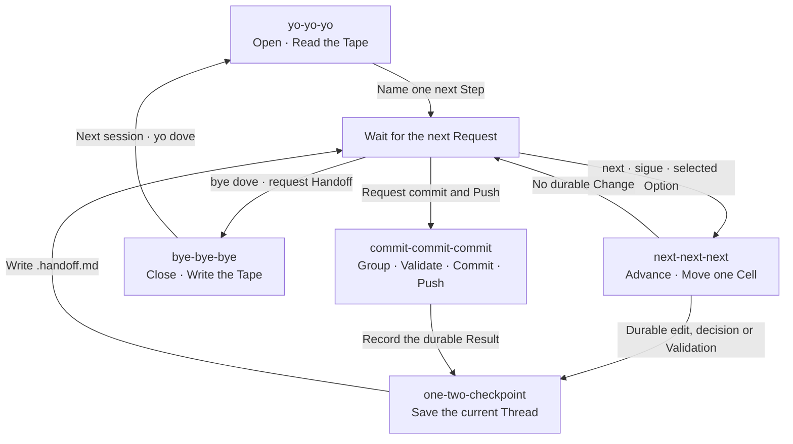

# The Lever and the Tape

- Three session Skills Stand together.
  One Opens, one Advances, one closes.
  Nobody Designed a machine; a machine appeared.

- The Name is the Lever. A triple Chant Pulls it,
  and the pull is Ritual — cheap, loud, and wanted.
- The Handoff is the Tape. State Lives outside the head,
  so any session can read where the last one stopped.
- One step per invocation is the head Moving one cell.
  Read the Tape, take the Step, write the next symbol, halt.
- Opening, advancing and closing form a Ring across sessions.
  The next Request Chooses the Transition.
  A Halt after one Step leaves the Session open.
- [OneTwoCheckpoint](../.agents/skills/one-two-checkpoint/SKILL.md) Saves a durable change during work.
  [ByeByeBye](../.agents/skills/bye-bye-bye/SKILL.md) Expands that state when the session closes.
  Both Write `.handoff.md`; the next opening reads it.
- [CommitCommitCommit](../.agents/skills/commit-commit-commit/SKILL.md) Publishes when requested.
  Feature Commits Come first; one push follows successful validation and commits.
  Publication does not Close the session.
- [OneTwoGrowth](../.agents/skills/one-two-growth/SKILL.md) Checks the scope as work accumulates.
  It Keeps one Intent in view before another step compounds it.
- A machine that takes two steps cannot be Stopped between them.
  The Halt is what Makes the Ritual safe to repeat.
- The chance is only in the Chant, never in the transition.
  A Lever that surprises is a Slot Machine.
  A Lever that resolves is a Groove.
