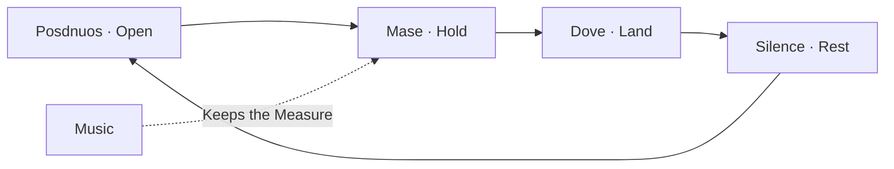

# Rhythm

- Contrast Carries the Line.  
  A short one after a long one Lands like a chorus.
- Uniform Text Hides what matters.  
  Never Write every line the same length,  
  not in prose and not in code.
- Count the Syllables if it helps.  
  Odd often Swings.  
  But a signal is not a Law, and the count is only a signal.
- The Haiku Counts five, seven, five.  
  Every Line Lands Odd.
- A Name that says an Action Counts too.  
  SumItemPrices Runs five.
- A bare Noun Keeps its own Count.  
  Order is Order, whatever it sounds like.
- Four is the Beat, Three is the Phrase.  
  They meet again every twelve,  
  so the tension always Resolves.
- A Line should Take you a Bar, or a measure.  
  Read it out loud — you'll Feel where it lands.

## Read the Rotation

Posdnuos Opens the Thought.

Mase Holds the Measure underneath.

Dove Finds the Line where it lands.

Read the long line as the Opening.

Read the short line as the Landing.

Leave the Space between them unsaid.

- A List Stays Parallel.  
  A Paragraph Varies.  
  Contrast is for Prose, never for an index.
