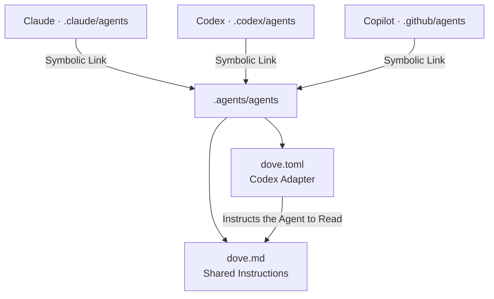

# Vendor Integration

- Keep shared Instructions in one canonical source.
  Vendor directories must not Hold independent copies.
- Expose that Source through relative symbolic links
  where the tool supports them.
- Add only the Metadata and format adapter each vendor requires.
  The Adapter Points to the Instructions; it never repeats them.

## One Source, every Entrance

This repository Keeps agent instructions in `.agents/agents/`
and skills in `.agents/skills/`.
Every vendor Entrance Resolves to one of those two directories:

```text
CLAUDE.md      -> AGENTS.md
.claude/agents -> ../.agents/agents
.claude/skills -> ../.agents/skills
.codex/agents  -> ../.agents/agents
.github/agents -> ../.agents/agents
.github/skills -> ../.agents/skills
```

Codex Reads `.agents/skills/` where it already lives, and needs no link.
An entrance that repeats what the client already finds is Clutter,
so count the missing Entrances, never the symmetrical ones.

`CLAUDE.md` is an Entrance too. The client Looks for that name,
and the link Hands it `AGENTS.md` instead of a second copy to drift.

The shared Markdown Defines the agent's Voice and behavior.
The small TOML Adapter Identifies the Codex agent
and instructs it to read that markdown before it talks.

Skills use the shorter `one-two-` Prefix.
The repeated three-part names Mark fundamental workflow operations —
open, advance, commit and close — so they stand out from the rest.
[yo-yo-yo](../.agents/skills/yo-yo-yo/SKILL.md) Opens the session.
[next-next-next](../.agents/skills/next-next-next/SKILL.md) Advances one step.
[commit-commit-commit](../.agents/skills/commit-commit-commit/SKILL.md) Handles commits and the final push.
[bye-bye-bye](../.agents/skills/bye-bye-bye/SKILL.md) Closes with a handoff.
The typography skill is [de-la-case](../.agents/skills/de-la-case/SKILL.md),
and its convention is [DeLaCase](de-la-case.md).
The third word Carries no stage; the triple chant is the lever,
and [The Lever and the Tape](../patterns/the-lever-and-the-tape.md) Draws it.



A Link Shares Files; it does not convert formats.
The TOML reference is an Instruction to the agent,
not an automatic markdown import.

## Keep the Boundary small

- Edit shared Behavior in the canonical source only.
  Vendor adapters Hold discovery metadata and loading instructions.
- Link only the shared Subdirectory.
  Keep vendor settings and local Secrets outside it.
- Validate link Targets and adapter syntax after a change.
  Verify Discovery in the target tool before claiming runtime support.

When a tool cannot follow a link or read the shared source,
Generate its required file from that source.
Mark the output as Generated; never maintain a second copy by hand.

The file Integration follows the same boundary as
[Providers](providers.md): the shared contract Owns the meaning,
and the vendor addition only adapts the entrance.
