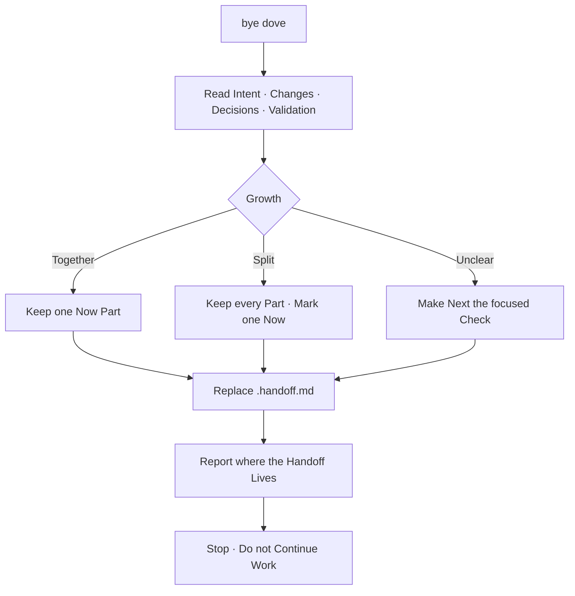

# ByeByeBye

A session Closing, not a Summary for Display.
It Leaves the next Session one durable Thread to pick up.

The next Turn Lives in [YoYoYo](../yo-yo-yo/SKILL.md).
The Canon Lives in [Change Growth](../../../rules/change-growth.md).
The working Snapshot Lives in [OneTwoCheckpoint](../one-two-checkpoint/SKILL.md).
The Shape Lives in [The Lever and the Tape](../../../patterns/the-lever-and-the-tape.md).



## When it Runs

Invoke when the user says `bye dove`, asks to stop,
or Requests a handoff for the next session.

## Evidence

Read only the current Thread and current repository state:

1. **Checkpoint** — `.handoff.md` when it Holds the current working snapshot.
   Confirm it against the thread and repository state; never trust stale Claims.
2. **Intent** — the ask that still Explains the work.
3. **Changes** — staged, unstaged and untracked Paths,
   plus the relevant Change in each affected file.
4. **Decisions** — choices the next session must Preserve.
5. **Validation** — checks already Run and their result.
6. **Growth** — whether the Work is `Together`, `Split` or `Unclear`.

Do not reconstruct old History unless the current thread refers to it.
Do not review the Code or invent work that was not discussed.

## Write the Handoff

Write `.handoff.md` at the repository Root.
Replace its content when it already Exists;
one Repository Holds one active Handoff.
Expand a compact Checkpoint into this full closing shape.

Use this Shape:

```markdown
# Handoff

**Intent** — the one Outcome being pursued.

**Done** — durable Work already completed.

**Open** — the unresolved Decision, edit or validation.

**Growth** — Together, Split or Unclear.

**Now** — the one Part to resume first.

**Later** — deferred Parts, or none.

**Files**
- `path` — Added, Modified, Deleted or Renamed.
  What changed, why it matters, and the pending Detail needed to continue.

**Validation** — the Command and its result, or Not Run.

**Next** — one concrete Action.
```

The files Section makes the Handoff usable without repository access.
List every File affected by the active work, including already committed files
the next session must understand. For each one, name its State and
summarize the relevant change. Include a small exact Snippet when names,
values, signatures or unfinished text cannot be recovered reliably from prose.
Do not copy a whole File or a large diff.

Keep claims Factual and paths repository-relative.
Mark uncertain claims as `Inferred`.
Never Store secrets, tokens, terminal history or full conversation text.

When growth is `Split`, preserve every Part
but mark exactly one as `Now`.
When growth is `Unclear`, make `Next` the focused Check
that can separate the intents.

## What it Returns

After writing, say only what was Left and where:

```text
✅ Handoff Written to .handoff.md
The next session Starts with: one concrete action.
```

## Bounds

- Never Commit or push the handoff.
- Never stage Files.
- Never continue Implementation after writing it.
- Never Hide failed or missing validation.
- Never Include unrelated dirty paths.
- Never Assume the next session can open an affected file.
- Never Leave two parts marked `Now`.
