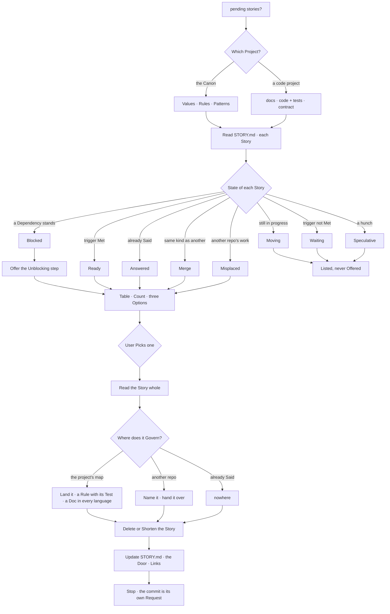

# The Distillation Flow

> Draft. Written from one session of practice, not yet Weathered.

Chaos Fills the Passage; what Governs Drains it.
This is how one Story leaves, in the Canon or in a code project.

## Two Maps, one Passage

The Stages never change. The Destinations do.

| Piece | The Canon | A Code Project |
| --- | --- | --- |
| raw life | `chaos/`, never committed | `chaos/` — logs, emails, transcripts |
| the Door | `README.md` | a root `MEMORY.md` indexing `docs/` |
| a Belief | `values/` | — |
| a Decision | — | `docs/`, in every language the project Keeps |
| a Rule | `rules/` | code, held by a Test |
| a Root | `patterns/` | — |
| a Promise | — | the API contract, such as `openapi.yaml` |
| to Build | `stories/roadmap.md` | wherever the project tracks work |

A project Names its own map in its `STORY.md` diagram.  
muchi-api was the first: a Decision, a Rule, a Promise.  
Read that diagram before the table above.

- In the Canon a Rule is Prose an agent Runs.  
  In a code project a Rule is Code, and a Test is what makes it Executable.
- In the Canon a Story is a lesson waiting.  
  In a code project it may be work that has not stopped Moving.  
  A Moving story never Drains early; it Leaves when the work does.

## Three Questions

Every Story Answers three, in this order:

1. **Can it move?** Its own `Distill when` line Decides.  
   A Story Names its trigger when it is written;  
   the Survey only Reads whether it has fired.
2. **Is it already said?** Grep the Destinations before you write.  
   A Story something already Answers is not knowledge; it is a reminder.  
   It Leaves without adding a Line.
3. **Where does it Govern?** The project's map, or not here at all.  
   A to-do list for one project Belongs to that project.

## What the first Session Found

- *Own linter* and *Modular cluster with LiteLLM* were both  
  things to Build. Neither was a Belief, so neither could reach the Canon.  
  Together they Became one roadmap, and a slot Opened.
- *What the Muchi refactor left open* held three points.  
  The Canon already Answered two; they were muchi-api's work, not ours.  
  One real question Remained, waiting for a second adapter.
- *Color by semantic association* was two ideas under one title.  
  Code Coloured by the AST was free to build;  
  Prose Coloured by role was Blocked on a tagger and a palette.  
  Waiting could not Name that; Blocked was Added for it.
- A merge Frees a slot; a shortened story Keeps it.  
  Only a Story that Leaves makes room for the tenth.

## Open

- Is `stories/roadmap.md` a Story, or a Stage of its own  
  beside the Passage, the way Jokes are?
- Should this Flow reach the README, under "How Context Becomes Canon",  
  once a second session has used it?
