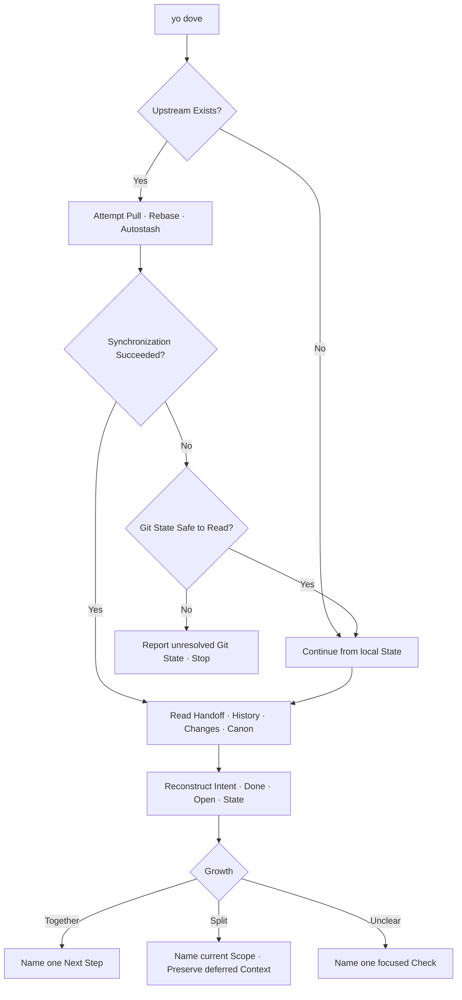

# YoYoYo

A session Opening, not a standup and not a code Review.
It Reconstructs where the work stopped,
checks whether the change stayed one change,
and leaves one Part ready to continue.

The next Turn Lives in [NextNextNext](../next-next-next/SKILL.md).
The Canon Lives in [Change Growth](../../../rules/change-growth.md).
The Shape Lives in [The Lever and the Tape](../../../patterns/the-lever-and-the-tape.md).



## When it Runs

Use at the Beginning of a new session when recent work may matter.
Also use when the user Asks where they were, what remains,
or whether the work has become too large.

Do not invoke for a clean, self-contained Ask
that does not depend on earlier work.

## Synchronize

Before reading the Handoff or reconstructing state,
identify the current Branch and its configured upstream.
When an upstream Exists, attempt within available permissions:

```
git pull --rebase --autostash
```

This Pulls remote commits, rebases local commits when needed,
and preserves staged and unstaged Changes across the rebase.
Then read git State again; the reconstructed session starts there.
Synchronization is best effort, not a Prerequisite for opening a session.

When no upstream Exists, name the branch and continue without pulling.
Never create an Upstream during session opening.
If synchronization is unavailable, denied or Fails without leaving
an unresolved operation or conflict, report the limitation and Continue
from local evidence. Do not request additional Permission solely
to synchronize during session opening.
Do not claim the local state Reflects the latest remote state.
If a rebase or merge remains in progress, or conflicts remain
after autostash restoration, stop and report the exact Git state.

## Evidence

Read the smallest recent Window that explains the current state:

1. **Continuity** — `.handoff.md` at the repository Root, when present.
   It may Hold a compact working checkpoint or a full closing handoff.
   Treat either as the previous session's explicit State,
   then confirm its claims against current repository State.
2. **History** — recent Sessions for this repository,
   newest first. Read summaries, user intent, decisions,
   touched files and the last unresolved Step.
3. **Changes** — current branch, staged, unstaged and untracked Paths,
   plus a focused Diff summary and recent commits when needed.
4. **Canon** — the rule or nearby plan Named by that work,
   only when it Changes what should continue.

The Handoff Names the Continuation. History Explains it.
Git Confirms the durable State.
No one source Overrides a present disagreement.

Prefer the local session Store for history.
Scope it to the current Repository or working directory
and start with the most recent seven Days.
If the store is unavailable or empty, say so and Continue from git.
Never invent missing Intent from a diff.

If `.handoff.md` is absent, Continue from history and git.
Do not Create, rewrite or delete the handoff during session opening.

Do not read every Turn, every diff or the whole repository.
Expand one nearby Session or one changed path only when the summary
cannot distinguish the active Intent from a completed one.

## Reconstruct the Handoff

Name four Things:

1. **Intent** — what the latest coherent work was trying to Achieve.
2. **Done** — what history and changes Agree is already complete.
3. **Open** — the concrete unresolved Decision, edit or validation.
4. **State** — changed Paths, branch and relevant recent commit.

Mark uncertain claims as `Inferred`.
If history and git Disagree, name the disagreement
and trust neither until one focused Check resolves it.

## Check the Growth

Group recent Work by intent, not by file count alone.
Ask:

1. Does one intent Explain every relevant change?
2. Did a second responsibility, deliverable or boundary Appear?
3. Can the next step be Named with one action?

Return one State:

- `Together` — one intent still Holds the work.
- `Split` — two or more intents now Compete.
- `Unclear` — the available evidence cannot Separate them.

Three changed files are a Prompt to check, not proof of excess.
Several intents in one file still Mean `Split`.
Do not review Quality, find bugs or rank severity.

## Go by Parts

When the state is `Split`, divide by independent Intent.
For each Part, name its outcome and owned paths.
Order parts by Dependency:

1. the Part that unblocks the others;
2. the smallest independently verifiable Part;
3. the remaining Parts, each for a later thread.

Select exactly one `Now` part as the current Scope.
Everything else Becomes `Later` context.
Neither label is an executable Recommendation.
Name exactly one `Next` step inside the current Scope.
Do not Edit, stage, commit or start a second part during this opening.

When the state is `Together`, name one next Step.
When it is `Unclear`, name one focused Check that can decide.

When the user must choose, end with three numbered Options
and do not name a `Next` until the user Answers.
The chosen Number becomes the next Step.

## What it Returns

Keep the Opening short and ground every claim in a session,
a path, a commit or an explicit user message.

```text
**Where we were** — Add session continuity to project Skills.

**Done** — the growth rules already Define Together, Split and Unclear.
**Open** — Connect recent session intent with the current git state.
**State** — 2 modified Paths on main; no relevant commit yet.

⚠️ **Growth: Split**

**Now** *(current scope)* — Build the session-opening Skill.
**Later** *(context only)* — Wire client discovery and reload it.

**Next** — Validate the Skill frontmatter and links.
```

If there is no relevant unfinished work, Say:

```text
✅ No unfinished Thread found.
The new ask can Begin from a clean intent.
```

## Bounds

- Never Present inference as recorded history.
- Never force Pull, force push or discard local changes.
- Never continue past an unresolved Rebase or autostash conflict.
- Never absorb unrelated dirty Paths into the active work.
- Never call growth a Code Review.
- Never continue two Parts in one thread.
- Never present `Now` or `Later` as executable Recommendations.
- Never mix a standing `Next` with numbered Options.
- Never require session History when git can still state the known facts.
- Never claim the session Store is current after an unavailable or failed query.
