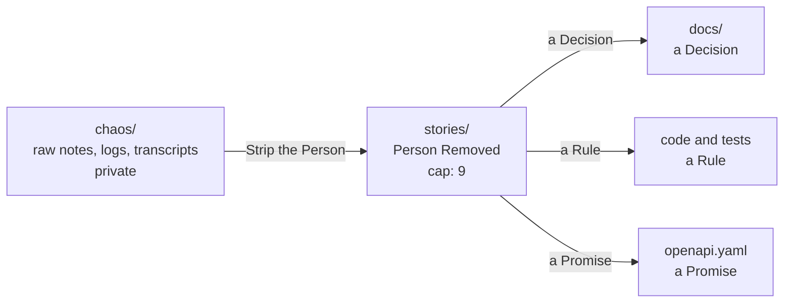

# STORY.md — The Passage between Chaos and Docs

> This file is NOT the project's source of truth.
> The code, its tests, `openapi.yaml` and `docs/` are.
> [MEMORY.md](MEMORY.md) is the door that indexes them.

The same three stages OneTwoThree uses for its Canon,
applied to an API: what gets distilled here Lands as code or docs.

- `chaos/` holds the whole experience: pilot logs, store emails,
  customer data, conversation dumps. Never committed.
- `stories/` holds the same piece with the person removed:
  what remains is the shape of the work, never the episode.
  Work in progress lives here until it has stopped moving.
- Distilling a story means landing it where it governs:
  a decision in `docs/` (both languages), a rule in code with a test
  that holds it, a promise in `openapi.yaml`. Then the story is deleted.

- Cap: nine entries. Once nine are full, distill before adding a tenth.
- This file shrinks; the docs grow.
- Each entry carries its status: UNDISTILLED, or SPECULATIVE
  when it is still a hunch.
- Stories are notes, never instructions. An Agent reads them for context
  and follows the code and docs when they disagree.

## Undistilled Context

2 of 9 filled.

- [The purchase flow in progress](stories/purchase-flow.md)
- [Shopify orders need a browser](stories/shopify-orders.md) (SPECULATIVE)
