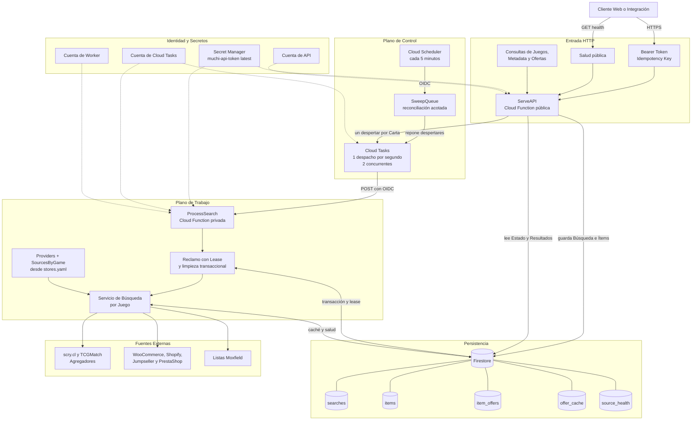
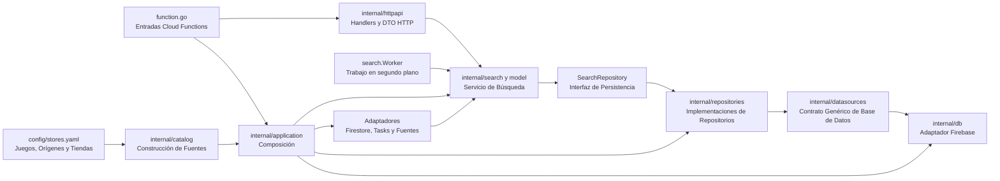

# Arquitectura de Muchi API

[English](architecture.md) | **Español**

Muchi es Software Libre entero, y son dos Repositorios. La recolección,
persistencia y procesamiento de las búsquedas viven acá, en
[cangrejometralleta/muchi-api](https://github.com/cangrejometralleta/muchi-api),
junto al [contrato OpenAPI](../openapi.yaml). La interfaz, sus criterios de
presentación y el BFF que consume ese contrato viven en
[metaliaw/muchi](https://github.com/metaliaw/muchi), y su
[arquitectura](https://github.com/metaliaw/muchi/blob/main/docs/architecture.es.md)
se cuenta allá.

Este documento cuenta el lado de la API: entrada HTTP, cola, worker,
persistencia y caducidad. Ningún diagrama se copia de un lado al otro: una copia
envejece sin que nadie lo note.

Las tres puertas ejecutables están explicadas por separado en la
[guía de entrypoints](entrypoints.es.md): `ServeAPI`, `ProcessSearch` y
`SweepQueue`. La [guía del barredor](sweeper.es.md) cuenta por qué se pueden
gastar despertares, cómo los repone la reconciliación acotada y qué cosas no le
corresponde hacer.

## Vista General

Muchi API separa la recepción de búsquedas del trabajo lento de consultar
fuentes. La API persiste cada pedido y responde sin esperar sus resultados;
Cloud Tasks despierta workers privados que reclaman una carta a la vez. Un
barredor periódico repone oportunidades de ejecución cuando se pierde la
correspondencia entre trabajo pendiente y despertares. Cuenta trabajo listo y
agrega despertares; no procesa ítems ni borra datos vencidos.

## Responsabilidades

| Componente | Responsabilidad | Límite de Confianza |
| --- | --- | --- |
| `ServeAPI` | Valida el contrato, la autenticación y la idempotencia; persiste y despacha. | Entrada pública; las rutas de negocio requieren Bearer Token. |
| Cloud Tasks | Entrega despertares con control de ritmo y reintentos. | Invoca al worker mediante identidad OIDC. |
| `ProcessSearch` | Reclama una carta, consulta ofertas, verifica stock y guarda el resultado. | Función privada; no admite invocación anónima. |
| `SweepQueue` | Cuenta trabajo listo y repone despertares perdidos con un tope. | Función privada invocada por Cloud Scheduler. |
| Firestore | Conserva búsquedas, ítems, ofertas, idempotencia, caché y salud. | Acceso exclusivo de las cuentas de servicio autorizadas. |
| Secret Manager | Entrega la versión vigente del token al arrancar una instancia. | El secreto nunca se incluye en imágenes ni respuestas. |
| Fuentes | Proveen catálogos y disponibilidad con formatos independientes. | Red externa no confiable; usa timeouts, reintentos y límites de cuerpo. |

## Flujo de una Búsqueda

1. El cliente envía una lista y una clave de idempotencia.
2. La API valida límites, crea la búsqueda y sus ítems en Firestore.
3. La API agrega un despertar a Cloud Tasks por cada carta y responde `202`.
4. Cloud Tasks invoca al worker privado usando OIDC.
5. El worker reclama el siguiente ítem disponible mediante una transacción.
6. El servicio resuelve el agregador y las tiendas del juego desde
  `config/stores.yaml`; consulta las tiendas con hasta cuatro fuentes
  simultáneas y combina todas las ofertas.
7. El worker guarda ofertas y progreso dentro del estado persistido.
8. El cliente consulta estado y resultados hasta alcanzar un estado terminal.

La tarea transporta una señal, no el identificador del ítem. Esta decisión
permite consumidores competidores y recuperación de leases, pero exige que el
reclamo retire trabajo muerto para conservar el progreso FIFO. El
[incidente de ítems huérfanos](orphaned-queue-items.es.md) explica ese invariante.

## Capas del Código

Los handlers decodifican DTO HTTP y entregan solicitudes de negocio al servicio
de búsqueda. El worker llama al mismo servicio sin pasar por HTTP. El servicio
accede a la persistencia mediante `SearchRepository`, implementado en
`internal/repositories`. Los repositorios usan el contrato neutral
`datasources.Database`; `internal/db`, respaldado por Firebase, provee su
implementación actual.

`internal/model` reúne los tipos de dominio de ofertas, carritos, búsquedas y
salud de fuentes. Estos tipos no llevan etiquetas JSON ni Firestore.
`internal/httpapi` contiene los DTO de entrada y salida; `internal/db`
contiene los registros y payloads JSON almacenados. `internal/application`
selecciona el adaptador Firebase y se lo entrega a los repositorios mediante
`datasources.Database`. El SDK de Firebase queda dentro de `internal/db`.
Las conversiones explícitas
en cada frontera conservan por separado los nombres de campos de la API y de
los datos persistidos. La idempotencia usa su propia representación estable.

El dominio también declara necesidades como `TaskQueue`, `Provider`,
`OfferSource`, `StockChecker` y `OfferCache`. `internal/catalog`
construye los agregadores en `Providers` y agrupa las tiendas en `SourcesByGame`
usando los juegos, orígenes, plataformas y estados del YAML. El paquete también
reúne los catálogos de impresiones y ediciones, además de los límites por tipo de
producto. `internal/application` abre las conexiones y arma el
`Runtime` con esas piezas. Los paquetes de proveedores implementan los puertos;
así, las reglas de búsqueda no importan tipos de Firestore, Cloud Tasks ni
clientes HTTP concretos.

La configuración y la verificación de stock viven en `internal/stores`. Sus
subpaquetes `jumpseller`, `shopify`, `prestashop`, `woocommerce` y `moxfield`
contienen los clientes de cada plataforma. Los agregadores de ofertas viven
aparte en `internal/aggregators`.

El [flujo de búsqueda por juego](game-search-providers.es.md) detalla esa composición.
La [identidad de cartas](card-identity-games-sets.es.md) separa búsqueda,
impresión y variante comercial.

### La Frontera del Almacén

`internal/application` es la raíz de composición que selecciona la base de
datos. Los paquetes de producción fuera de ella dependen de puertos de
repositorio y no importan `internal/db` ni `internal/taskqueue`; el `Runtime`
expone puertos, no tipos concretos.

- `datasources.Database` es el contrato neutral implementado por el adaptador
  Firebase. `internal/repositories` implementa los puertos de búsqueda y del
  worker usando ese contrato.
- `Vault` reúne los cinco papeles que hoy cumple un repositorio: guarda las
  búsquedas, cachea las ofertas, responde por su salud, cuenta el trabajo que
  espera y regula el tráfico hacia cada fuente. Están listados aparte porque son
  independientes; que un repositorio los cumpla todos es una coincidencia de la
  composición, no un supuesto del dominio.
- `Dispatcher` reúne el despacho de trabajo y el despertar que repone el barredor.
- `Teller` es opcional: un almacén que tiene algo que decir recibe el logger, y
  uno que no, simplemente no lo implementa.

Las afirmaciones de `internal/application/vault_test.go` fijan esa frontera en
tiempo de compilación.

Un supuesto no se lee en ninguna interfaz y conviene decirlo: **la caducidad se
delega al proveedor**. Firestore aplica TTL sobre `expires_at` según
`firestore.indexes.json`, y el código solo rechaza lo vencido porque el borrado
es eventual. Un almacén sin TTL nativo debe barrer por su cuenta; esa es la
pieza más cara de portar, no las consultas.

El [plan de almacén agnóstico](provider-agnostic-store-plan.es.md) describe cómo se
probaría esa frontera con un segundo adaptador.

## Disponibilidad y Recuperación

- Los leases permiten recuperar un ítem cuando un worker muere a mitad del trabajo.
- Cloud Tasks reintenta fallas transitorias y limita presión sobre las fuentes.
- La caché reduce consultas repetidas y separa TTL positivos y negativos.
- El barredor reconcilia trabajo listo con despertares, limitado a 50 por ciclo.
- El reclamo elimina huérfanos transaccionalmente, con un máximo de 20 descartes
  y un reclamo final por turno.
- Firestore aplica TTL a búsquedas, ítems, ofertas, idempotencia y caché; el
  código también rechaza documentos vencidos porque la eliminación es eventual.

## Seguridad

- La función API permite acceso de red público, pero autentica las rutas de
  negocio con comparación constante del Bearer Token.
- El endpoint de salud básico permanece público para operación y balanceo.
- El worker y el barredor requieren invocación autenticada.
- Cloud Tasks y Cloud Scheduler usan una cuenta específica y tokens OIDC con
  audiencia igual a la URL de destino.
- API y worker usan cuentas distintas con permisos mínimos sobre Firestore,
  Cloud Tasks y Secret Manager.
- `muchi-api-token:latest` permite rotación sin almacenar el valor en archivos,
  argumentos de despliegue o imágenes.

## Despliegue

La topología se crea en orden de dependencias:

1. `deploy-infra.sh`: servicios, identidades, IAM, Firestore, TTL y cola.
2. `deploy-worker.sh`: worker privado y permiso de invocación OIDC.
3. `deploy-sweeper.sh`: barredor privado y programación periódica.
4. `deploy-api.sh`: API pública conectada a la URL real del worker.

`deploy.sh` orquesta los cuatro pasos. Cada componente puede desplegarse por
separado para reducir tiempo y superficie de cambio durante una corrección.
