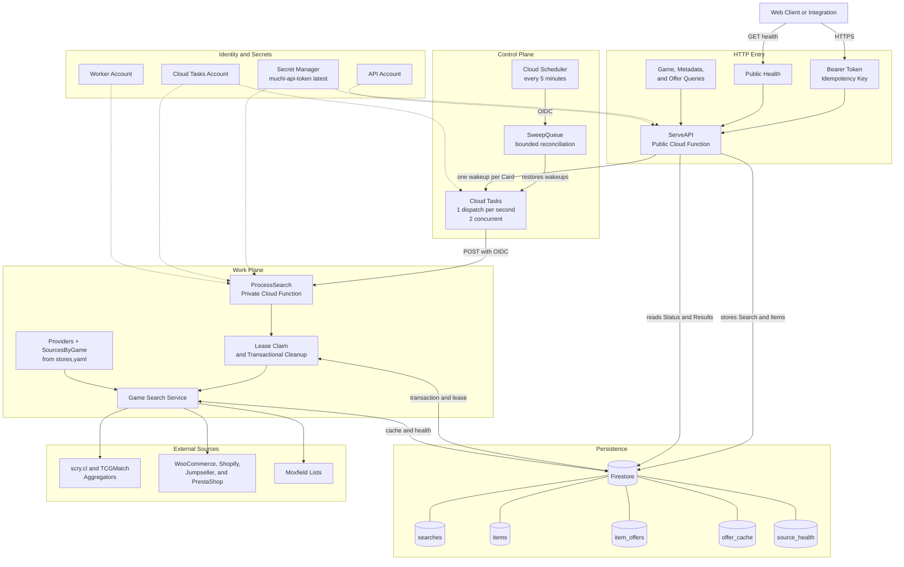
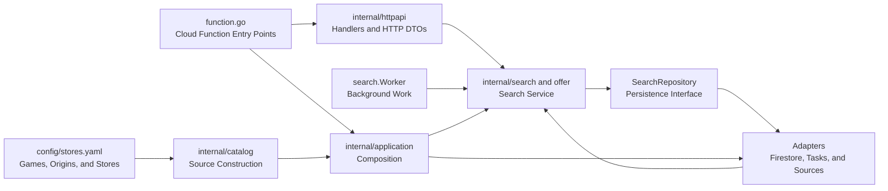

# Muchi API Architecture

[English](architecture.md) | [Español](architecture.es.md)

Muchi is free software across two repositories. Search collection, persistence,
and processing live here in
[cangrejometralleta/muchi-api](https://github.com/cangrejometralleta/muchi-api),
alongside the [OpenAPI contract](../openapi.yaml). The interface, its
presentation rules, and the BFF that consumes that contract live in
[metaliaw/muchi](https://github.com/metaliaw/muchi); its
[architecture](https://github.com/metaliaw/muchi/blob/main/docs/architecture.es.md)
is documented there.

This document covers the API side: HTTP entry points, queue, worker, persistence,
and expiration. Diagrams are not copied between the repositories; a copy grows
stale without anyone noticing.

The three executable doors are documented separately in the
[entry-point guide](entrypoints.md): `ServeAPI`, `ProcessSearch`, and
`SweepQueue`. The [sweeper guide](sweeper.md) explains why task wake-ups can be
spent, how bounded reconciliation restores them, and what the sweeper does not
own.

## Overview

Muchi API separates receiving searches from the slower work of querying sources.
The API persists each request and responds without waiting for results. Cloud
Tasks wakes private workers that claim one card at a time. A periodic sweeper
restores execution opportunities when pending work and task wakeups fall out of
sync. It counts ready work and adds wake-ups; it does not process items or
delete expired data.

## Responsibilities

| Component | Responsibility | Trust Boundary |
| --- | --- | --- |
| `ServeAPI` | Validates the contract, authentication, and idempotency; persists and dispatches. | Public entry; business routes require a Bearer Token. |
| Cloud Tasks | Delivers wakeups with rate control and retries. | Invokes the worker through OIDC identity. |
| `ProcessSearch` | Claims a card, queries offers, checks stock, and saves the result. | Private function; anonymous invocation is not allowed. |
| `SweepQueue` | Counts ready work and restores lost wakeups up to a limit. | Private function invoked by Cloud Scheduler. |
| Firestore | Stores searches, items, offers, idempotency, cache, and health. | Access is limited to authorized service accounts. |
| Secret Manager | Provides the current token version when an instance starts. | The secret is never included in images or responses. |
| Sources | Provide catalogs and availability through independent formats. | Untrusted external network; uses timeouts, retries, and body limits. |

## Search Flow

1. The client sends a list and an idempotency key.
2. The API validates limits and creates the search and its items in Firestore.
3. The API adds one Cloud Tasks wakeup per card and responds with `202`.
4. Cloud Tasks invokes the private worker using OIDC.
5. The worker claims the next available item in a transaction.
6. The service resolves the game's aggregator and stores from
   `config/stores.yaml`; it queries up to four stores concurrently and combines
   all offers.
7. The worker saves offers and progress in persisted state.
8. The client polls status and results until the search reaches a terminal state.

The task carries a signal, not an item ID. This lets competing consumers and
lease recovery make progress, but requires the claim to remove dead work so FIFO
progress is preserved. The [orphaned items incident](orphaned-queue-items.es.md)
explains this invariant.

## Code Layers

The HTTP handlers decode request DTOs and pass business inputs to the search
service. The worker calls the same service without HTTP. The service reaches
persistence through `SearchRepository`, which Firestore implements and tests can
replace with an in-memory implementation.

The domain also declares needs such as `TaskQueue`, `Provider`,
`OfferSource`, `StockChecker`, and `OfferCache`. `internal/catalog` builds the
aggregators in `Providers` and groups stores in `SourcesByGame` from the games,
origins, platforms, and enabled states in YAML. It also gathers print and set
catalogs, plus the product-kind limits. `internal/application` opens connections
and assembles the `Runtime` from those parts. Provider
packages implement the ports, so search rules do not import Firestore, Cloud
Tasks, or concrete HTTP client types.

Store configuration and stock checking live in `internal/stores`. Its
`jumpseller`, `shopify`, `prestashop`, `woocommerce`, and `moxfield` subpackages
contain the platform-specific clients. Offer aggregators live separately in
`internal/aggregators`.

The [game provider flow](game-search-providers.es.md) details this composition. The
[card identity guide](card-identity-games-sets.es.md) separates searches,
printings, and commercial variants.

### The Store Boundary

`internal/application` is the only package that names a storage provider. No
package outside it imports `internal/firestore` or `internal/taskqueue`; the
`Runtime` provides ports, not concrete types.

- `Vault` gathers the five roles currently served by one store: saving searches,
  caching offers, reporting its health, counting waiting work, and pacing
  traffic to each source. They are listed separately because they are
  independent; Firestore satisfying all five is a composition coincidence, not a
  domain assumption.
- `Dispatcher` gathers work dispatch and the wakeup that restores the sweeper.
- `Teller` is optional: a store with something to say receives a logger, while
  one that stays quiet simply does not implement it.

The assertions in `internal/application/vault_test.go` hold this boundary at
compile time.

One assumption is absent from the interfaces and should be explicit: **expiration
is delegated to the provider**. Firestore applies TTL to `expires_at` according
to `firestore.indexes.json`; the code rejects expired records because deletion
is eventual. A store without native TTL must sweep records itself. That is the
costliest piece to port, not the queries.

The [provider-agnostic storage plan](provider-agnostic-store-plan.es.md) describes how to
test this boundary with a second adapter.

## Availability and Recovery

- Leases recover an item when a worker dies mid-task.
- Cloud Tasks retries transient failures and limits pressure on sources.
- Caching reduces repeated queries and keeps positive and negative TTLs separate.
- The sweeper reconciles ready work with wakeups, with a limit of 50 per cycle.
- Claims transactionally remove orphans, with at most 20 discards and one final
  claim per turn.
- Firestore applies TTL to searches, items, offers, idempotency, and cache; the
  code also rejects expired records because deletion is eventual.

## Security

- The API function is publicly reachable, but authenticates business routes with
  a constant-time Bearer Token comparison.
- The basic health endpoint remains public for operations and load balancing.
- The worker and sweeper require authenticated invocation.
- Cloud Tasks and Cloud Scheduler use dedicated accounts and OIDC tokens whose
  audience matches the destination URL.
- The API and worker use separate accounts with minimum permissions for
  Firestore, Cloud Tasks, and Secret Manager.
- `muchi-api-token:latest` allows rotation without storing the value in files,
  deployment arguments, or images.

## Deployment

The topology is created in dependency order:

1. `deploy-infra.sh`: services, identities, IAM, Firestore, TTL, and queue.
2. `deploy-worker.sh`: private worker and OIDC invocation permission.
3. `deploy-sweeper.sh`: private sweeper and scheduled invocation.
4. `deploy-api.sh`: public API connected to the actual worker URL.

`deploy.sh` orchestrates all four steps. Each component can be deployed
separately to reduce time and change surface when fixing an issue.
