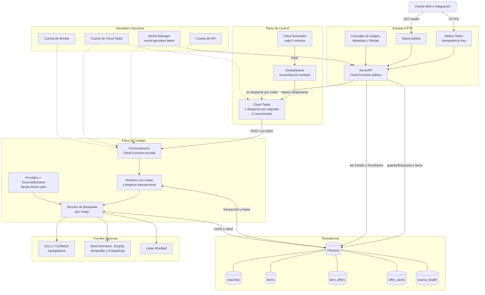
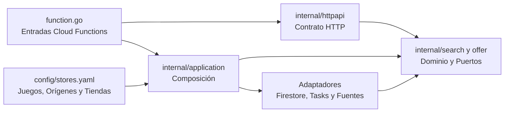

# Arquitectura de Muchi API

## Vista General

Muchi API separa la recepción de búsquedas del trabajo lento de consultar
fuentes. La API persiste cada pedido y responde sin esperar sus resultados;
Cloud Tasks despierta workers privados que reclaman una carta a la vez. Un
barredor periódico repone oportunidades de ejecución cuando se pierde la
correspondencia entre trabajo pendiente y despertares.

## Responsabilidades

| Componente | Responsabilidad | Límite de Confianza |
| --- | --- | --- |
| `ServeAPI` | Valida el contrato, la autenticación y la idempotencia; persiste y despacha. | Entrada pública; las rutas de negocio requieren Bearer Token. |
| Cloud Tasks | Entrega despertares con control de ritmo y reintentos. | Invoca al worker mediante identidad OIDC. |
| `ProcessSearch` | Reclama una carta, consulta ofertas, verifica stock y guarda el resultado. | Función privada; no admite invocación anónima. |
| `SweepQueue` | Cuenta trabajo listo y repone despertares perdidos con un tope. | Función privada invocada por Cloud Scheduler. |
| Firestore | Conserva búsquedas, ítems, ofertas, idempotencia, caché y salud. | Acceso exclusivo de las cuentas de servicio autorizadas. |
| Secret Manager | Entrega la versión vigente del token al arrancar una instancia. | El secreto nunca se incluye en imágenes ni respuestas. |
| Fuentes | Proveen catálogos y disponibilidad con formatos independientes. | Red externa no confiable; usa timeouts, reintentos y límites de cuerpo. |

## Flujo de una Búsqueda

1. El cliente envía una lista y una clave de idempotencia.
2. La API valida límites, crea la búsqueda y sus ítems en Firestore.
3. La API agrega un despertar a Cloud Tasks por cada carta y responde `202`.
4. Cloud Tasks invoca al worker privado usando OIDC.
5. El worker reclama el siguiente ítem disponible mediante una transacción.
6. El servicio resuelve el agregador y las tiendas del juego desde
  `config/stores.yaml`; consulta las tiendas con hasta cuatro fuentes
  simultáneas y combina todas las ofertas.
7. El worker guarda ofertas y progreso dentro del estado persistido.
8. El cliente consulta estado y resultados hasta alcanzar un estado terminal.

La tarea transporta una señal, no el identificador del ítem. Esta decisión
permite consumidores competidores y recuperación de leases, pero exige que el
reclamo retire trabajo muerto para conservar el progreso FIFO. El
[incidente de ítems huérfanos](cola-items-huerfanos.md) explica ese invariante.

## Capas del Código

El dominio declara necesidades como `SearchStore`, `TaskQueue`, `Provider`,
`OfferSource`, `StockChecker` y `OfferCache`. `internal/application` construye
los agregadores en `Providers` y agrupa las tiendas en `SourcesByGame` usando los
juegos, orígenes, plataformas y estados del YAML. Los paquetes de proveedores
implementan esos puertos. Así, las reglas de búsqueda no importan tipos de
Firestore, Cloud Tasks ni clientes HTTP concretos.

El [flujo de búsqueda por juego](busqueda-proveedores.md) detalla esa composición.
La [identidad de cartas](identidad-cartas-juegos-ediciones.md) separa búsqueda,
impresión y variante comercial.

## Disponibilidad y Recuperación

- Los leases permiten recuperar un ítem cuando un worker muere a mitad del trabajo.
- Cloud Tasks reintenta fallas transitorias y limita presión sobre las fuentes.
- La caché reduce consultas repetidas y separa TTL positivos y negativos.
- El barredor reconcilia trabajo listo con despertares, limitado a 50 por ciclo.
- El reclamo elimina huérfanos transaccionalmente, con un máximo de 20 descartes
  y un reclamo final por turno.
- Firestore aplica TTL a búsquedas, ítems, ofertas, idempotencia y caché; el
  código también rechaza documentos vencidos porque la eliminación es eventual.

## Seguridad

- La función API permite acceso de red público, pero autentica las rutas de
  negocio con comparación constante del Bearer Token.
- El endpoint de salud básico permanece público para operación y balanceo.
- El worker y el barredor requieren invocación autenticada.
- Cloud Tasks y Cloud Scheduler usan una cuenta específica y tokens OIDC con
  audiencia igual a la URL de destino.
- API y worker usan cuentas distintas con permisos mínimos sobre Firestore,
  Cloud Tasks y Secret Manager.
- `muchi-api-token:latest` permite rotación sin almacenar el valor en archivos,
  argumentos de despliegue o imágenes.

## Despliegue

La topología se crea en orden de dependencias:

1. `deploy-infra.sh`: servicios, identidades, IAM, Firestore, TTL y cola.
2. `deploy-worker.sh`: worker privado y permiso de invocación OIDC.
3. `deploy-sweeper.sh`: barredor privado y programación periódica.
4. `deploy-api.sh`: API pública conectada a la URL real del worker.

`deploy.sh` orquesta los cuatro pasos. Cada componente puede desplegarse por
separado para reducir tiempo y superficie de cambio durante una corrección.
