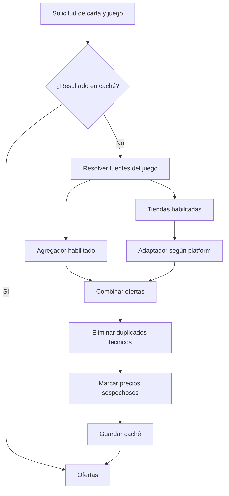
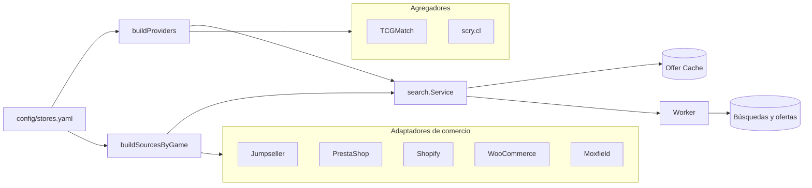

# Búsqueda por juego, agregadores y tiendas

[English](game-search-providers.md) | **Español**

Cada juego combina dos clases de fuente declaradas en `config/stores.yaml`:

- Los agregadores de `search_providers` buscan ofertas publicadas por terceros.
- Las tiendas de `stores` consultan su comercio mediante un adaptador genérico.

Una tienda participa cuando está habilitada, incluye el juego en `games` y su
`platform` aparece en `games.<juego>.origins`. Un agregador participa cuando está
habilitado, incluye el juego y su tipo aparece en los mismos `origins`.

## Flujo

El agregador y las tiendas pueden publicar una misma oferta. La deduplicación
técnica usa `store + URL + variant_id`; conserva resultados de distinta edición,
idioma o variante. Dos fuentes con URLs diferentes no se consideran duplicadas
aunque representen la misma carta y precio. Cualquier deduplicación semántica
futura debe apoyarse en identidad de tienda, edición, idioma, acabado y condición,
no solo en el nombre de la carta.

## Arquitectura

`SourcesByGame` mantiene las tiendas separadas por juego. Los adaptadores
implementan `OfferSource.FindOffers`; los agregadores implementan
`Provider.Search`. `search.Service` combina ambos resultados y aplica la misma
deduplicación antes de persistirlos.

## Tiempos y coordinación

Cada tienda puede declarar `estimated_response_seconds`. Es el tiempo estimado
de una búsqueda completa, distinto de `timeout_seconds`, que limita una solicitud
HTTP individual. La latencia real se registra por dominio en `source_health`.

Actualmente las tiendas se ejecutan con un máximo de cuatro fuentes concurrentes.
El tiempo estimado se expone como configuración, pero todavía no ordena ni agrupa
los turnos. Decks Cards está estimada en 145 segundos y suele determinar la duración
total de una búsqueda de Yu-Gi-Oh! cuando su caché está vacía.

## Ejemplo: Yu-Gi-Oh!

Para `Dark Magician`, la configuración activa TCGMatch, Decks Cards y Netdecker.
Una medición viva obtuvo 58 ofertas en 2 minutos y 25 segundos: 41 de TCGMatch,
17 de Decks Cards y ninguna de Netdecker. No hubo duplicados entre fuentes bajo
la clave semántica observada de carta, tienda, precio, moneda e idioma.
