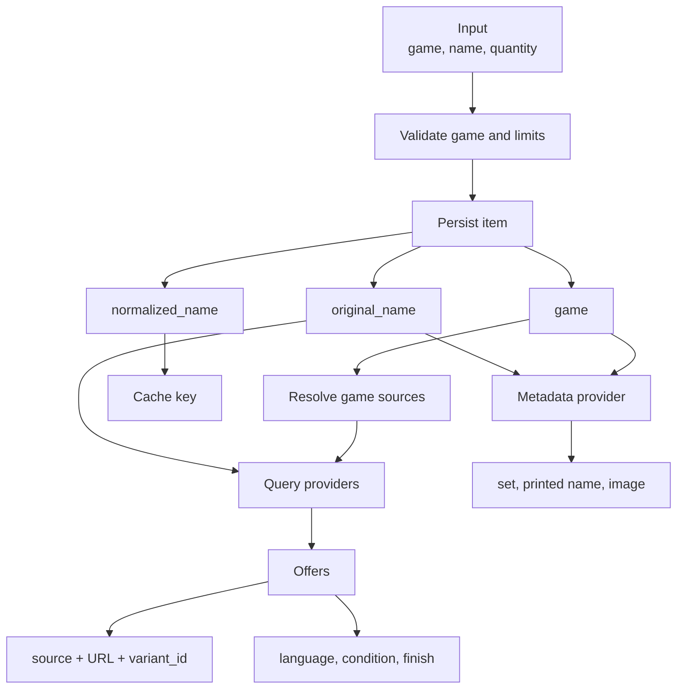

# Card Identity Across Games and Sets

[English](card-identity-games-sets.md) | [Español](card-identity-games-sets.es.md)

## Summary

A card does not have one useful identity for every part of the system. Muchi
separates the user's request, the card recognized by a catalog, a specific
printing, and the commercial offer. Each level adds context without replacing
the previous one.

The challenge appeared when adding multiple games, visual metadata, languages,
and sets. Keeping only the name could mix catalogs. Choosing an image by name
could show the wrong printing. Treating every printing as a separate card, on
the other hand, split a search that should collect comparable offers.

## Identity Levels

| Level | Identity | Purpose |
| --- | --- | --- |
| Search | `game + normalized_name` | Select catalog, sources, and cache. |
| Request | `original_name + quantity` | Preserve user intent and presentation. |
| Metadata | `name + language + edition + foil` | Resolve printed name, image, and reference URL. |
| Offer | `source + URL + variant_id` | Identify a specific commercial variant. |

`NormalizeCard` lowercases the name, collapses repeated spaces, and trims its
edges. It does not translate names, remove semantic punctuation, or decide
whether two sets represent the same printing.

## Identity Flow

## The Game Travels with the Work

The game is declared once in `CreateInput` and copied to both the `Job` and each
`Item`. The worker does not infer it again from the name. This persistence
matters because a task may run later, in another instance, with a different
source list from the one serving another game.

When the client omits `game`, the API preserves compatibility by using `magic`.
An explicit input must never be replaced by that default.

## Original and Normalized Names

`OriginalName` preserves what the user wrote and is used to query sources.
`NormalizedName` stabilizes cache keys and comparisons. Both are persisted: the
first keeps meaning for responses and diagnostics; the second prevents spacing
or capitalization from creating separate equivalent searches.

Store matching accepts delimited set, art, or rarity suffixes, such as
`Dark Magician - RA05-EN083` and `Dark Magician (Arkana)`. It does not use an
arbitrary substring, which would include different cards such as
`Dark Magician Girl`.

## Metadata Is Not an Offer

Metadata answers a presentation question: which printed name, set, image, and
reference page belong to a card. An offer answers who sells a variant, at what
price, and with what availability.

That is why `cardmetadata.Request` accepts `language`, `edition`, and `foil`
without making them part of the primary search identity. Scryfall first tries an
exact printing when it receives a set; without one, it may resolve by language
or name. It must not assume a specific variant when the request does not specify
one.

## Commercial Variants

An offer preserves `VariantID`, language, condition, and finish when the source
publishes them. The URL should point to that variant whenever the platform
allows it. This makes it possible to check price or stock again without
resolving the entire product again.

Technical deduplication uses `Store + URL + VariantID`. Offers with the same
name are not duplicates by themselves: they may represent different sets,
languages, conditions, or finishes. Deduplicating an aggregator against a store
requires a richer semantic identity than the normalized name.

## Invariants

1. The requested game travels with persisted work until completion.
2. The cache key includes the game and normalized name.
3. The original name is never reconstructed from its normalized form.
4. Metadata does not present an unrequested set as an exact user choice.
5. A commercial variant keeps its source identifier and URL.
6. Deduplication does not collapse distinct variants that share a name.

## Current Limits

`CardInput` contains a name and quantity, but no set, language, or finish. These
qualifiers exist in metadata and offers, not in the persisted search request. A
future choice of a specific printing must expand the input contract, cache key,
and stored model together.

TCGMatch may return textually related products. Direct stores already filter
base names and known suffixes; the aggregator still needs the same boundary to
avoid results such as `Dark Magician Girl` when searching for `Dark Magician`.
