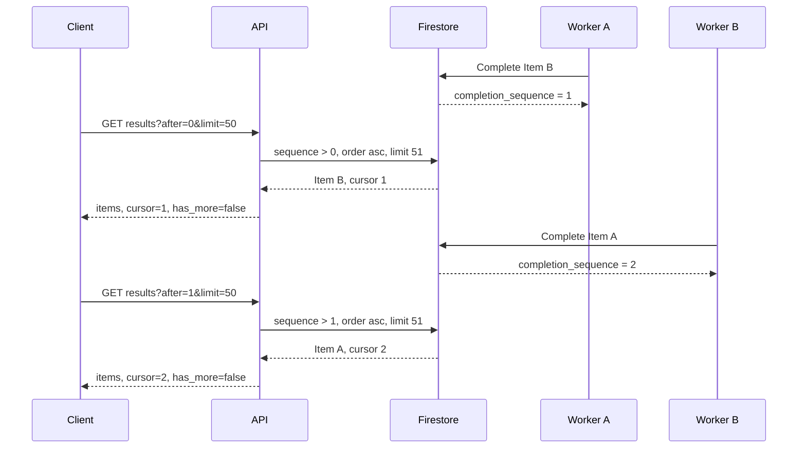
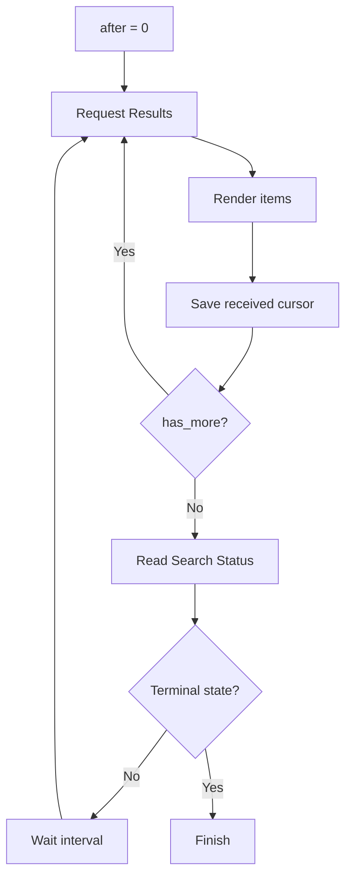

# Cursor Pagination and Consistency

**English** | [Español](cursor-pagination-consistency.es.md)

## Summary

Search results complete out of order: multiple workers may process different
cards, and a slow source may finish after a later card from the input list.
Paginating by original position forces clients to reread pending items or leaves
gaps while the search continues.

Muchi paginates by `completion_sequence`, assigned when each item reaches a
terminal state. The cursor represents observed progress, not a static page or
the original position of the card.

## The Problem

The first implementation kept every item ID on the search and loaded them one at
a time when listing results. That model had three costs:

- One read per item, including items that were still pending.
- Responses that grew as the search grew.
- No stable boundary for a client to request only new results.

Input position did not solve the problem either. If card 1 took two minutes and
card 2 finished first, waiting for original order hid an available result.

## Completion Sequence

When a worker completes an item, the transaction reads its parent search,
assigns `completion_sequence = job.processed + 1`, saves the item and its offers,
and updates search progress. Two workers trying to use the same sequence
conflict on the parent document; Firestore retries a transaction, so each
committed item receives a distinct sequence.



The client receives B before A because B finished first. It does not lose A: it
keeps cursor 1, and the next request finds any later sequence.

## HTTP Contract

`GET /v1/searches/{search_id}/results` accepts:

- `after`: last consumed `completion_sequence`; defaults to `0`.
- `limit`: maximum number of items; defaults to `50`, maximum `100`.

The response contains:

- `items`: terminal results after the cursor.
- `cursor`: sequence of the last returned item, or the received cursor if there
  were no items.
- `has_more`: whether additional results already exist after this page.

`has_more: false` does not necessarily mean the search is finished. It only means
there was no next materialized page at that moment. The search status determines
whether the client should keep polling.

## Query and Index

Firestore runs one query per page:

```text
search_id == ID
completion_sequence > after
order by completion_sequence ascending
limit limit + 1
```

The extra item is not returned; it only determines `has_more`. The query needs
the composite index on `search_id` and `completion_sequence` in
`firestore.indexes.json`.

Offers live in `item_offers`. After selecting the page's items, the Store loads
each matching offers document. Items outside the page do not trigger offer reads.

## Polling Protocol



The cursor should advance only after processing the response. If the client fails
before that, it can repeat the same `after`: reads are stable and items can be
rendered idempotently by ID.

## Invariants

1. Only terminal items receive a positive `completion_sequence`.
2. The sequence is unique and increasing within a search.
3. Completing an item and advancing progress happen in one transaction.
4. An empty page never moves the cursor backward.
5. `has_more` describes available data, not terminal search state.
6. Repeating a page with the same cursor does not lose results.
7. Original position is for presentation, not incremental pagination.

## Limits

The cursor is an internal integer, not an immutable snapshot. It is designed for
a search that only appends terminal results and does not reorder completed items.
If the system allowed editing or deleting results during polling, it would need
an opaque cursor with an explicit versioning policy.

Documents are subject to TTL. A client resuming a search after expiration gets
`not found`; the cursor does not extend the lifetime of results.
