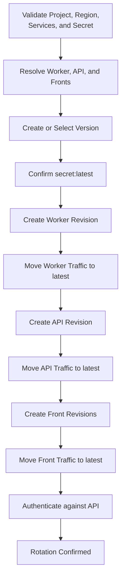

# Deployment, Revisions, and Secret Rotation

**English** | [Español](deployment-revisions-secrets.es.md)

## Summary

Rotating `MUCHI_API_TOKEN` left the API returning `401` even though Secret
Manager showed the correct version as `latest`. The secret was not broken:
Cloud Run still routed all traffic to an old revision with a different value.

The incident showed that rotating a shared credential is not an isolated write.
It is a coordinated deployment across the secret, Cloud Run revisions, and all
consumers: Worker, API, and Fronts.

## Symptom

- Secret Manager had a new version, enabled and marked `latest`.
- The scripts showed the new token.
- The API rejected that token with `401`.
- New revisions appeared ready but received `0%` of traffic.
- API and Worker continued serving from old revisions.

The API stayed on a revision created after secret version 2, while versions 3
and 4 and several later revisions never received traffic.

## Root Cause

Rotation ended with `update-traffic --to-revisions=REVISION=100`. That command
pins the service to one specific revision. Later deployments can create healthy
revisions without moving traffic to them.

At the same time, some deployments resolved `latest` to a number before
injecting it. That left two persistent decisions that could drift apart:

1. Which secret version a revision mounts.
2. Which revision receives service traffic.

## Corrected Flow

The order follows traffic from inside out. The Worker serves no direct clients;
the API depends on its contract; the Fronts depend on the API. Each service
creates a revision mounting `MUCHI_API_TOKEN=secret-name:latest`, then moves
traffic with `--to-latest`.

## Why `latest` Does Not Update a Running Instance

Cloud Run resolves the Secret Manager reference when creating a revision or
instance, according to its configuration. Changing which version `latest` means
does not rewrite the environment of an already active revision. Rotation creates
a new revision for each consumer and routes traffic to it.

The live reference avoids pinning a number in the deployment template, but it
does not remove the need to restart or update consumers during rotation.

## Resumable Operation

Before creating a version, `rotate-secret.sh` checks:

- That the secret exists.
- That API and Worker resolve to valid Cloud Run services.
- That each consumer mounts `MUCHI_API_TOKEN` from Secret Manager.
- Which Fronts exist in the region.
- That at least one Front is deployed.

A configured Front that is not deployed yet produces a warning and is skipped.
Resolving consumers before creating the token prevents a partial rotation caused
by a wrong service name or region.

If the process fails after creating a version, it preserves the version number
and prints the command to resume with `--version`. The operation can continue
without creating another credential or losing its place.

## Rollback

When all services point to `secret:latest`, returning to an older version does
not mean deploying a numbered reference. Disable later Secret Manager versions
until the desired version becomes `latest`, then update the consumer revisions.

Rollback must also follow the Worker, API, Fronts order. Mixing tokens during
the transition causes authentication failures even when every component is
healthy on its own.

## Verification

Rotation does not end when Cloud Run reports a revision ready. It ends when an
authenticated request reaches the API through the active URL and gets `200` from
`GET /v1/health/sources`.

This check validates three facts at once:

1. Traffic reached the new revision.
2. The revision resolved the expected secret version.
3. The client uses the credential accepted by the API.

## Invariants

1. No deployment permanently pins traffic with `--to-revisions`.
2. Every template mounts `MUCHI_API_TOKEN` from Secret Manager.
3. A rotation lists every consumer before creating a version.
4. Worker, API, and Fronts are updated from inside out.
5. A failure preserves enough state to resume the same version.
6. Success requires an authenticated check against the active service.
7. Preview output does not modify secrets, revisions, or traffic.

## Tools

- `deploy.sh` deploys Infrastructure, Worker, Sweeper, and API in order.
- `deploy-common.sh` shares validation, identity, and `gcloud` access.
- `rotate-secret.sh` coordinates rotation across Worker, API, and Fronts.
- `get-secret.sh` syncs an authorized version with the local environment.

Shared values live in `config/deploy.env`. Local credential files stay outside
the repository and are created with restrictive permissions.
