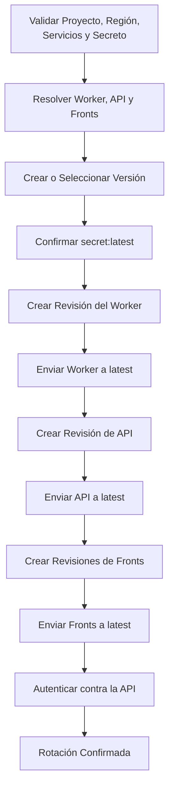

# Despliegue, Revisiones y Rotación de Secretos

## Resumen

Una rotación de `MUCHI_API_TOKEN` dejó la API respondiendo `401` aunque Secret
Manager mostraba la versión correcta como `latest`. El secreto no estaba dañado:
Cloud Run seguía enviando todo el tráfico a una revisión antigua que conservaba
otro valor.

El incidente mostró que rotar una credencial compartida no es una escritura
aislada. Es un despliegue coordinado entre el secreto, las revisiones de Cloud Run
y todos sus consumidores: Worker, API y Fronts.

## Síntoma

- Secret Manager tenía una versión nueva, habilitada y marcada como `latest`.
- Los scripts mostraban el token nuevo.
- La API rechazaba ese token con `401`.
- Revisiones nuevas aparecían listas, pero recibían `0%` del tráfico.
- API y Worker continuaban sirviendo desde revisiones antiguas.

La API permaneció en una revisión creada después de la versión 2 del secreto,
mientras las versiones 3 y 4 y varias revisiones posteriores nunca recibieron
tráfico.

## Causa Raíz

La rotación terminaba con `update-traffic --to-revisions=REVISION=100`. Esa orden
convierte el servicio en uno fijado a una revisión concreta. Los despliegues
posteriores pueden crear revisiones sanas sin mover el tráfico hacia ellas.

Al mismo tiempo, algunos despliegues resolvían `latest` a un número antes de
inyectarlo. Así quedaban dos decisiones persistentes que podían divergir:

1. Qué versión del secreto monta una revisión.
2. Qué revisión recibe el tráfico del servicio.

## Flujo Corregido

El orden sigue el tráfico de adentro hacia afuera. El Worker no atiende clientes
directos; la API depende de su contrato; los Fronts dependen de la API. Cada
servicio crea una revisión que monta `MUCHI_API_TOKEN=nombre:latest` y luego mueve
el tráfico con `--to-latest`.

## Por Qué `latest` no Actualiza una Instancia Viva

Cloud Run resuelve la referencia de Secret Manager al crear una revisión o una
instancia según su configuración. Cambiar qué versión significa `latest` no
reescribe el entorno de una revisión ya activa. La rotación fuerza una revisión
nueva para cada consumidor y dirige el tráfico hacia ella.

La referencia viva evita fijar un número en la plantilla de despliegue, pero no
elimina la necesidad de reiniciar o actualizar consumidores durante una rotación.

## Operación Reanudable

Antes de crear una versión, `rotate-secret.sh` verifica:

- Que el secreto exista.
- Que API y Worker resuelvan a servicios Cloud Run válidos.
- Que cada consumidor monte `MUCHI_API_TOKEN` desde Secret Manager.
- Qué Fronts existen en la región.
- Que exista al menos un Front desplegado.

Un Front configurado pero todavía ausente produce un aviso y se omite. Resolver
los consumidores antes de crear el token evita una rotación parcial causada por
un nombre o una región incorrectos.

Si el proceso falla después de crear una versión, conserva su número y muestra
el comando para reanudar con `--version`. La ejecución puede continuar sin generar
otra credencial ni perder el punto alcanzado.

## Rollback

Cuando todos los servicios apuntan a `secret:latest`, volver a una versión anterior
no consiste en desplegar una referencia numérica. Se deshabilitan las versiones
posteriores en Secret Manager hasta que la versión deseada vuelva a ser `latest`,
y después se actualizan las revisiones consumidoras.

El rollback también debe respetar el orden Worker, API y Fronts. Mezclar tokens
durante la transición produce fallas de autenticación aunque cada componente sea
sano por separado.

## Verificación

La rotación no termina cuando Cloud Run informa una revisión lista. Termina cuando
una petición autenticada alcanza la API mediante la URL activa y recibe `200` en
`GET /v1/health/sources`.

La comprobación valida tres hechos a la vez:

1. El tráfico llegó a la revisión nueva.
2. La revisión resolvió la versión esperada del secreto.
3. El cliente usa la misma credencial que la API acepta.

## Invariantes

1. Ningún despliegue fija tráfico permanente con `--to-revisions`.
2. Todas las plantillas montan `MUCHI_API_TOKEN` desde Secret Manager.
3. Una rotación enumera todos los consumidores antes de crear la versión.
4. Worker, API y Fronts se actualizan de adentro hacia afuera.
5. Una falla conserva suficiente estado para reanudar la misma versión.
6. El éxito requiere una prueba autenticada sobre el servicio activo.
7. La salida de vista previa no modifica secretos, revisiones ni tráfico.

## Herramientas

- `deploy.sh` despliega Infraestructura, Worker, Barredor y API en orden.
- `deploy-common.sh` comparte validación, identidad y acceso a `gcloud`.
- `rotate-secret.sh` coordina la rotación sobre Worker, API y Fronts.
- `get-secret.sh` sincroniza una versión autorizada con el entorno local.

Los valores compartidos viven en `config/deploy.env`. Los archivos locales con
credenciales permanecen fuera del repositorio y se crean con permisos restrictivos.
