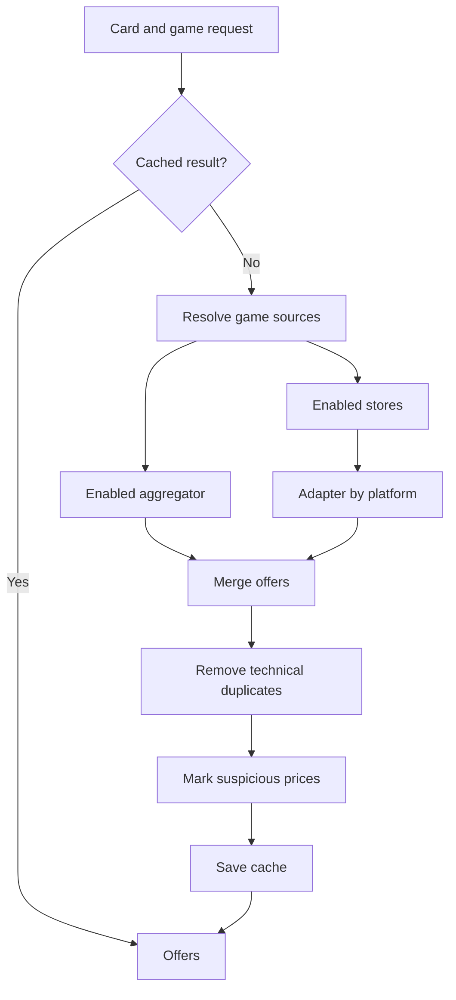
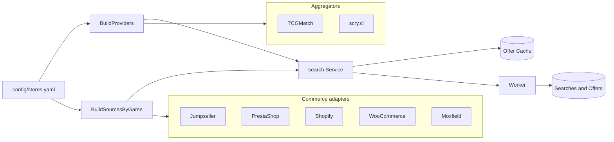

# Game Search, Aggregators, and Stores

[English](game-search-providers.md) | [Español](game-search-providers.es.md)

Each game combines two kinds of sources declared in `config/stores.yaml`:

- Aggregators in `search_providers` search offers published by third parties.
- Stores in `stores` query their commerce platform through a generic adapter.

A store participates when it is enabled, lists the game in `games`, and its
`platform` appears in `games.<game>.origins`. An aggregator participates when it
is enabled, lists the game, and its type appears in the same `origins` list.

## Flow

An aggregator and a store may publish the same offer. Technical deduplication
uses `store + URL + variant_id`; it preserves results from different sets,
languages, or variants. Two sources with different URLs are not considered
duplicates even when they represent the same card and price. Any future semantic
deduplication should rely on store identity, set, language, finish, and
condition—not only the card name.

## Architecture

`SourcesByGame` keeps stores separate by game. Adapters implement
`OfferSource.FindOffers`; aggregators implement `Provider.Search`.
`search.Service` combines both results and applies the same deduplication before
persisting them.

## Timing and Coordination

Each store may declare `estimated_response_seconds`. This estimates a complete
search and differs from `timeout_seconds`, which limits one HTTP request. Actual
latency is recorded by domain in `source_health`.

Stores currently run with a maximum of four concurrent sources. Estimated time
is exposed as configuration, but it does not yet order or group work. Decks
Cards is estimated at 145 seconds and often determines the total duration of a
Yu-Gi-Oh! search when its cache is empty.

## Example: Yu-Gi-Oh!

For `Dark Magician`, the configuration enables TCGMatch, Decks Cards, and
Netdecker. A live measurement returned 58 offers in 2 minutes and 25 seconds: 41
from TCGMatch, 17 from Decks Cards, and none from Netdecker. There were no
cross-source duplicates under the observed semantic key of card, store, price,
currency, and language.
