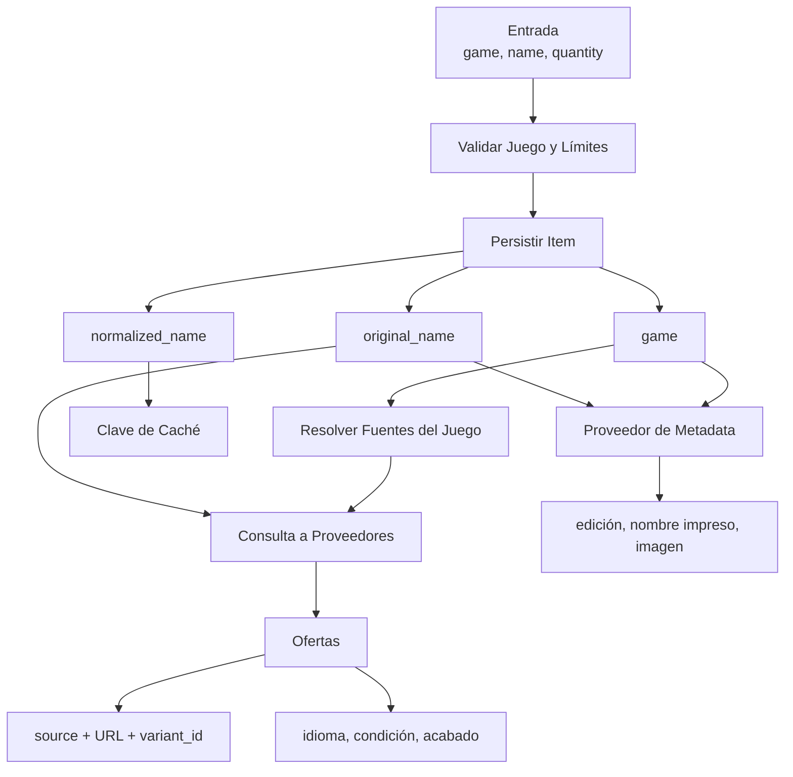

# Identidad de Cartas entre Juegos y Ediciones

## Resumen

Una carta no tiene una única identidad útil para todo el sistema. Muchi separa
el pedido del usuario, la carta reconocida por un catálogo, una impresión concreta
y la oferta comercial. Cada nivel agrega contexto sin reemplazar al anterior.

El desafío apareció al incorporar varios juegos, metadata visual, idiomas y
ediciones. Conservar solamente el nombre permitía mezclar catálogos. Elegir una
imagen por nombre podía mostrar otra edición. Tratar cada impresión como una carta
distinta, en cambio, fragmentaba una búsqueda que debía reunir ofertas comparables.

## Niveles de Identidad

| Nivel | Identidad | Propósito |
| --- | --- | --- |
| Búsqueda | `game + normalized_name` | Elegir catálogo, fuentes y caché. |
| Pedido | `original_name + quantity` | Conservar la intención y presentación del usuario. |
| Metadata | `name + language + edition + foil` | Resolver nombre impreso, imagen y URL de referencia. |
| Oferta | `source + URL + variant_id` | Identificar una variante comercial concreta. |

`NormalizeCard` pasa el nombre a minúsculas, elimina espacios repetidos y recorta
bordes. No traduce nombres, no elimina puntuación semántica y no decide si dos
ediciones representan la misma impresión.

## Flujo de Identidad

## El Juego Viaja con el Trabajo

El juego se declara una vez en `CreateInput` y se copia tanto al `Job` como a cada
`Item`. El worker no lo vuelve a inferir desde el nombre. Esa persistencia importa
porque una tarea puede ejecutarse después, en otra instancia y con una lista de
fuentes diferente a la que atiende otro juego.

Cuando el cliente omite `game`, la API conserva compatibilidad usando `magic`.
Una entrada explícita nunca debe ser reemplazada por ese valor por defecto.

## Nombre Original y Nombre Normalizado

`OriginalName` conserva lo escrito por el usuario y se usa para consultar fuentes.
`NormalizedName` estabiliza claves de caché y comparación. Ambos se persisten: el
primero mantiene significado para respuestas y diagnóstico; el segundo evita que
espacios o mayúsculas creen búsquedas equivalentes separadas.

La coincidencia de tiendas acepta sufijos delimitados de edición, arte o rareza,
por ejemplo `Dark Magician - RA05-EN083` y `Dark Magician (Arkana)`. No usa una
subcadena libre, porque eso incorporaría cartas distintas como `Dark Magician Girl`.

## Metadata no es Oferta

La metadata responde una pregunta de presentación: qué nombre impreso, edición,
imagen y página de referencia corresponden a una carta. La oferta responde quién
vende una variante, a qué precio y con qué disponibilidad.

Por eso `cardmetadata.Request` admite `language`, `edition` y `foil` sin convertirlos
en la identidad de la búsqueda principal. Scryfall intenta primero una impresión
exacta cuando recibe edición; si no hay edición, puede resolver por idioma o nombre.
No debe asumir una variante concreta cuando el pedido no la especifica.

## Variantes Comerciales

Una oferta conserva `VariantID`, idioma, condición y acabado cuando la fuente los
publica. La URL debe apuntar a esa variante siempre que la plataforma lo permita.
Esto hace posible volver a consultar precio o stock sin repetir la resolución del
producto completo.

La deduplicación técnica usa `Store + URL + VariantID`. Dos ofertas con el mismo
nombre no son duplicadas por sí solas: pueden pertenecer a ediciones, idiomas,
condiciones o acabados distintos. Para deduplicar entre un agregador y una tienda
se necesita una identidad semántica más rica que el nombre normalizado.

## Invariantes

1. El juego solicitado acompaña al trabajo persistido hasta su finalización.
2. La caché incluye el juego y el nombre normalizado.
3. El nombre original no se reconstruye desde una forma normalizada.
4. La metadata no elige una edición que el usuario no pidió como si fuera exacta.
5. Una variante comercial conserva su identificador y URL de origen.
6. La deduplicación no colapsa variantes distintas por compartir nombre.

## Límites Actuales

`CardInput` contiene nombre y cantidad, pero no edición, idioma ni acabado. Esos
calificadores existen en metadata y ofertas, no en la búsqueda persistida. Una
selección futura de impresión concreta debe ampliar el contrato de entrada, la
clave de caché y el modelo almacenado al mismo tiempo.

TCGMatch puede devolver productos relacionados por texto. Las tiendas directas
ya filtran nombres base y sufijos conocidos; el agregador todavía necesita aplicar
la misma frontera para evitar resultados como `Dark Magician Girl` al buscar
`Dark Magician`.
