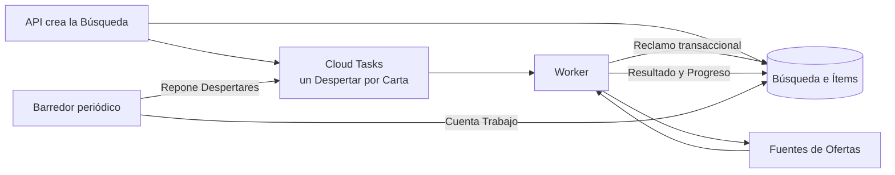
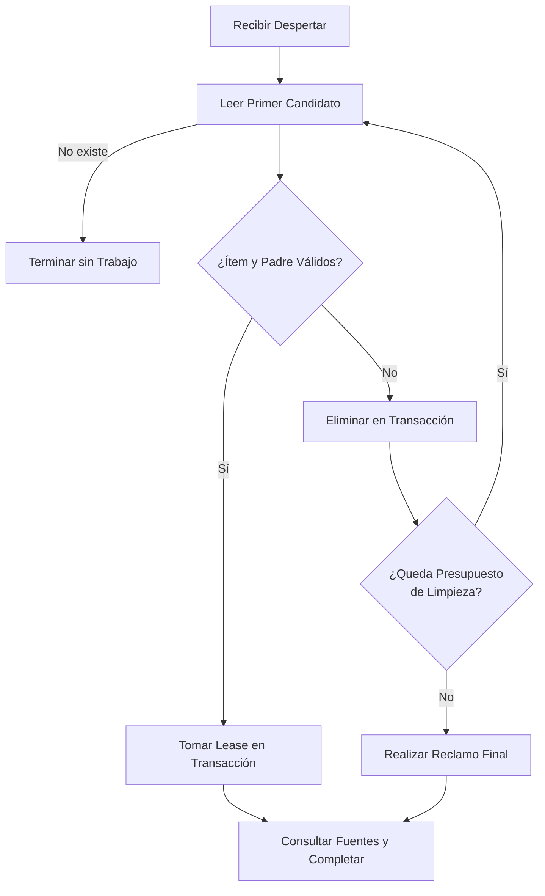

# Incidente de Ítems Huérfanos en la Cola

[English](orphaned-queue-items.md) | **Español**

## Resumen

Una búsqueda se guardaba correctamente y Cloud Tasks entregaba sus tareas, pero
el worker respondía `204` sin procesar cartas. Las búsquedas permanecían en
`queued` con `processed: 0`, incluso cuando la cola parecía activa.

La causa no estaba en el transporte. Un grupo de ítems antiguos había perdido
su búsqueda padre por la eliminación TTL de Firestore. Esos ítems huérfanos
ocupaban siempre el comienzo de la consulta ordenada. Cada worker encontraba
los mismos candidatos, no podía reclamarlos y terminaba sin alcanzar el trabajo
válido ubicado después.

La solución convierte el descarte de un candidato muerto en parte explícita y
transaccional del protocolo de reclamo. Un turno elimina ítems huérfanos de
forma acotada y luego intenta reclamar trabajo válido.

## Síntomas Observados

- `POST /v1/searches` respondía con una búsqueda válida en `queued`.
- Cloud Tasks despachaba al ritmo configurado y el worker respondía `204`.
- El contador `processed` no avanzaba.
- Los logs repetían `Claim Skipped Every Candidate` con los mismos identificadores.
- El barredor encontraba hasta 50 ítems esperando y agregaba nuevos despertares.
- Los despertares adicionales tampoco avanzaban la cola.

Una prueba productiva de cinco cartas reprodujo el incidente. Después de la
corrección terminó con cinco cartas procesadas, cinco encontradas y cero errores.

## Modelo de la Cola

La cola usa despertares sin carga útil. Una tarea no identifica una carta:
solamente pide a un worker que reclame el siguiente ítem disponible.



Este diseño desacopla la entrega de la identidad del trabajo. Permite que un
despertar procese cualquier ítem pendiente y simplifica los reintentos, pero
crea un invariante: cada turno debe poder avanzar más allá de candidatos que ya
no representan trabajo válido.

## Causa Raíz

Firestore elimina documentos TTL de manera eventual e independiente. La
búsqueda padre y sus ítems compartían una expiración lógica, pero no existía una
garantía de eliminación atómica. Durante esa ventana podía ocurrir esto:

1. La búsqueda padre expiraba o era eliminada.
2. Sus ítems continuaban en la colección `items`.
3. `available_at` mantenía esos ítems al comienzo del orden FIFO.
4. El worker consultaba solamente los primeros candidatos.
5. El reclamo rechazaba cada huérfano y devolvía `ErrNotFound`.
6. El siguiente despertar repetía exactamente la misma consulta.

El error de diseño fue tratar “no se pudo reclamar este candidato” como “no hay
trabajo”. Son estados diferentes:

- **Cola vacía:** no existe ningún candidato disponible.
- **Candidato muerto:** existe un documento, pero su unidad de trabajo ya no
  puede completarse.

El barredor amplificaba el síntoma. Contaba ítems disponibles sin comprobar que
la búsqueda padre siguiera viva, por lo que transformaba huérfanos en nuevos
despertares que volvían a consumir los mismos huérfanos.

## Patrón Aplicado

La resolución combina cuatro patrones de colas de trabajo.

### Consumidores Competidores

Varios workers reclaman trabajo mediante una transacción. El cambio de
`pending` a `running`, el dueño del lease y su vencimiento se escriben juntos.
Solo un consumidor puede obtener cada ítem.

### Descarte Transaccional de Trabajo Muerto

Cuando el documento está vencido, mal formado, cancelado o perdió su padre, el
worker lo elimina dentro de la misma transacción que intentó reclamarlo. Otro
worker no puede observar una limpieza parcial ni reclamar ese documento.

El descarte no se aplica a fallas transitorias. Un error de conectividad o del
servicio de Firestore se propaga para que Cloud Tasks reintente; borrar en ese
caso podría perder trabajo sano.

### Limpieza Acotada

Un turno elimina como máximo `maxClaimDiscards` candidatos muertos y realiza un
reclamo final. El límite impide que una cola muy dañada mantenga una función
abierta indefinidamente. El reclamo final evita el error de frontera donde se
limpiaban exactamente veinte huérfanos y se terminaba justo antes del primer
ítem sano.



### Reconciliación Periódica

El barredor conserva su función de reparar despertares perdidos. No reemplaza
el reclamo robusto: únicamente garantiza que el trabajo pendiente vuelva a
tener oportunidades de ejecución. La corrección importante vive en el
consumidor, donde se puede decidir con la búsqueda padre dentro de una
transacción.

## Por Qué No Bastaban Otras Soluciones

### Esperar al TTL

El TTL no promete eliminación inmediata ni orden coordinado entre colecciones.
Esperar podía recuperar la cola horas después, pero no garantizaba progreso.

### Enviar Más Despertares

Más tareas repetían la misma lectura FIFO. Aumentaban invocaciones y logs sin
cambiar el primer candidato elegible.

### Aumentar el Límite de la Consulta

Un límite mayor solo desplaza el punto de falla. Una acumulación suficiente de
huérfanos vuelve a bloquearla y cada turno lee documentos que sabe inválidos.

### Ignorar Cualquier Error del Padre

Confundir un `NotFound` lógico con una falla transitoria permitiría borrar
trabajo válido durante una interrupción de Firestore. La implementación separa
ambos casos antes de descartar.

## Invariantes Después de la Corrección

1. Un candidato muerto observado por un worker no vuelve a encabezar la cola.
2. Un error transitorio no causa eliminación de trabajo.
3. El reclamo de un ítem continúa siendo exclusivo y transaccional.
4. Cada turno tiene un costo de limpieza acotado.
5. Limpiar el máximo permitido no omite el reclamo sano inmediatamente posterior.
6. Los despertares son idempotentes respecto del trabajo: un turno sin trabajo
   puede terminar con `204` sin alterar búsquedas completadas.

## Verificación

La prueba `TestOrphanItemsLeaveTheQueue` crea veinte ítems cuyo padre no existe,
los coloca antes de una búsqueda sana y exige que un solo reclamo alcance esa
búsqueda. Se ejecuta contra el emulador de Firestore, porque la semántica de
transacciones y consultas es parte del comportamiento probado.

También se mantienen las pruebas de recuperación de leases, finalización,
documentos vencidos y conteo acotado del barredor. La suite se ejecuta con:

```sh
FIRESTORE_EMULATOR_HOST=127.0.0.1:8085 \
  go test ./internal/db -run TestOrphanItemsLeaveTheQueue -count=1
go test ./...
```

## Aplicación en Otros Sistemas

El patrón es útil cuando una cola transporta señales y el consumidor selecciona
el trabajo desde otra base de datos. Para replicarlo:

1. Define por separado la señal de ejecución y la unidad de trabajo.
2. Reclama mediante lease transaccional e idempotente.
3. Clasifica explícitamente cola vacía, trabajo muerto y dependencia transitoria.
4. Retira o pon en cuarentena el trabajo muerto en la frontera que lo detecta.
5. Limita la limpieza por turno y deja un reclamo final después del límite.
6. Usa reconciliación periódica para reparar señales perdidas, no para esconder
   un consumidor incapaz de avanzar.
7. Mide descartes, reclamos reales, latencia y edad del ítem más antiguo.

La propiedad buscada no es que cada despertar procese una carta. La propiedad
es que cada despertar produzca progreso observable: completar trabajo, retirar
trabajo imposible o informar una falla reintentable.
