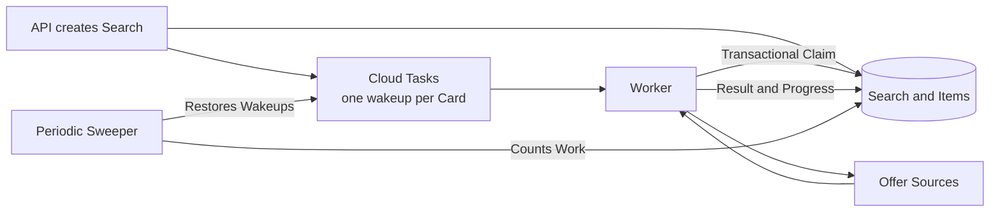
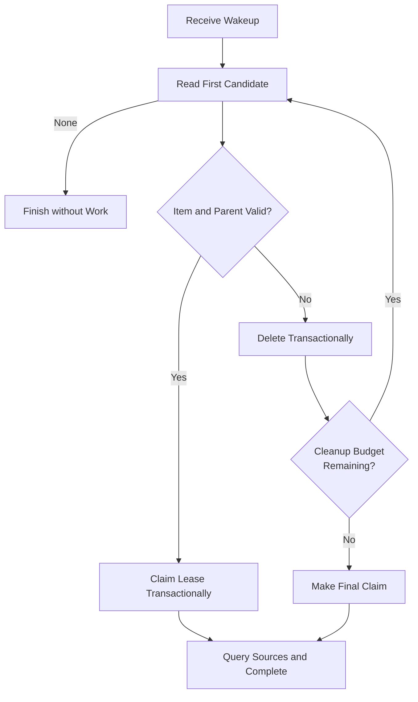

# Orphaned Queue Items Incident

[English](orphaned-queue-items.md) | [Español](cola-items-huerfanos.md)

## Summary

A search was saved and Cloud Tasks delivered its tasks, but the worker returned
`204` without processing cards. Searches remained `queued` with `processed: 0`,
even while the queue appeared active.

The cause was not the transport. A group of old items had lost their parent
search through Firestore TTL deletion. Those orphaned items always occupied the
start of the ordered query. Every worker found the same candidates, could not
claim them, and stopped before reaching valid work later in the queue.

The fix makes discarding a dead candidate an explicit, transactional part of the
claim protocol. One turn removes a bounded number of orphaned items and then
tries to claim valid work.

## Observed Symptoms

- `POST /v1/searches` returned a valid search in `queued` state.
- Cloud Tasks dispatched at its configured rate and the worker returned `204`.
- The `processed` counter did not advance.
- Logs repeated `Claim Skipped Every Candidate` with the same IDs.
- The sweeper found up to 50 waiting items and added wakeups.
- The extra wakeups did not advance the queue either.

A production test with five cards reproduced the incident. After the fix it
finished with five cards processed, five found, and zero errors.

## Queue Model

The queue uses wakeups with no payload. A task does not identify a card; it only
asks a worker to claim the next available item.



This design separates delivery from work identity. A wakeup can process any
pending item and retries are simpler, but it creates an invariant: each turn
must move past candidates that no longer represent valid work.

## Root Cause

Firestore deletes TTL documents eventually and independently. The parent search
and its items shared a logical expiration, but there was no guarantee of atomic
deletion. During that window:

1. The parent search expired or was deleted.
2. Its items remained in the `items` collection.
3. `available_at` kept those items at the head of FIFO order.
4. The worker queried only the first candidates.
5. The claim rejected every orphan and returned `ErrNotFound`.
6. The next wakeup repeated exactly the same query.

The design error was treating “could not claim this candidate” as “there is no
work.” They are different states:

- **Empty queue:** no available candidate exists.
- **Dead candidate:** a document exists, but its unit of work can no longer be
  completed.

The sweeper amplified the symptom. It counted available items without checking
that the parent search was still alive, turning orphans into new wakeups that
consumed the same orphans again.

## Applied Pattern

The resolution combines four work-queue patterns.

### Competing Consumers

Multiple workers claim work in a transaction. The transition from `pending` to
`running`, lease owner, and expiration are written together. Only one consumer
can obtain each item.

### Transactional Discard of Dead Work

If a document is expired, malformed, canceled, or has lost its parent, the worker
deletes it in the same transaction that tried to claim it. Another worker cannot
observe a partial cleanup or claim the same document.

This discard does not apply to transient failures. A connectivity or Firestore
service error is propagated so Cloud Tasks can retry; deleting on such an error
could lose healthy work.

### Bounded Cleanup

One turn deletes at most `maxClaimDiscards` dead candidates and makes one final
claim attempt. The limit prevents a badly damaged queue from keeping a function
open indefinitely. The final claim avoids a boundary error: cleaning exactly
twenty orphans must not stop immediately before the first healthy item.



### Periodic Reconciliation

The sweeper still repairs lost wakeups. It does not replace robust claiming; it
only ensures pending work gets another chance to run. The key correction lives in
the consumer, where the parent search can be checked inside a transaction.

## Why Other Fixes Were Not Enough

### Wait for TTL

TTL does not promise immediate deletion or coordinated ordering across
collections. Waiting might recover the queue hours later but would not guarantee
progress.

### Send More Wakeups

More tasks repeated the same FIFO read. They increased invocations and logs
without changing the first eligible candidate.

### Increase the Query Limit

A larger limit only moves the failure point. Enough orphans will block the query
again, and each turn reads documents already known to be invalid.

### Ignore Any Parent Error

Confusing logical `NotFound` with a transient outage could delete valid work
during a Firestore interruption. The implementation separates these cases before
discarding.

## Post-Fix Invariants

1. A dead candidate observed by a worker does not return to the head of the queue.
2. A transient failure never deletes work.
3. Claiming an item remains exclusive and transactional.
4. Cleanup cost per turn is bounded.
5. Reaching the cleanup limit does not skip the next healthy claim.
6. Wakeups are idempotent with respect to work: a turn with no work can return
   `204` without changing completed searches.

## Verification

`TestOrphanItemsLeaveTheQueue` creates twenty items whose parents do not exist,
places them before a healthy search, and requires one claim to reach that search.
It runs against the Firestore emulator because transaction and query semantics
are part of the behavior under test.

Lease recovery, completion, expired documents, and bounded sweeper counts are
also tested. Run the focused check with:

```sh
FIRESTORE_EMULATOR_HOST=127.0.0.1:8085 \
  go test ./internal/firestore -run TestOrphanItemsLeaveTheQueue -count=1
go test ./...
```

## Applying This to Other Systems

This pattern helps when a queue carries signals and the consumer selects work
from another database. To apply it:

1. Define the execution signal separately from the unit of work.
2. Claim with a transactional, idempotent lease.
3. Explicitly distinguish an empty queue, dead work, and a transient dependency.
4. Remove or quarantine dead work at the boundary that detects it.
5. Bound cleanup per turn and make a final claim after reaching the limit.
6. Use periodic reconciliation to repair lost signals, not to hide a consumer
   that cannot advance.
7. Measure discards, successful claims, latency, and the age of the oldest item.

The goal is not for every wakeup to process a card. The goal is for every wakeup
to produce observable progress: complete work, remove impossible work, or report
a retryable failure.
