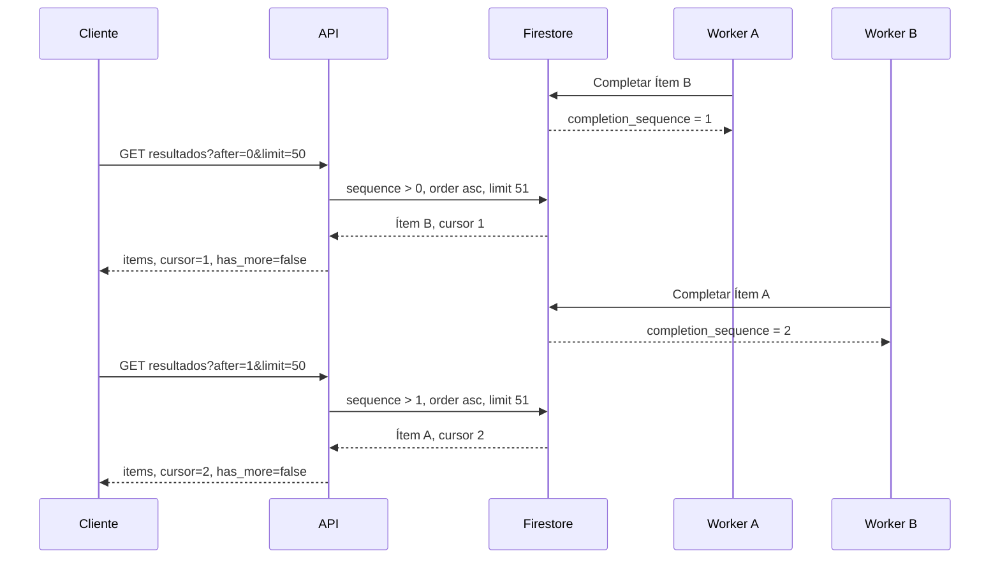
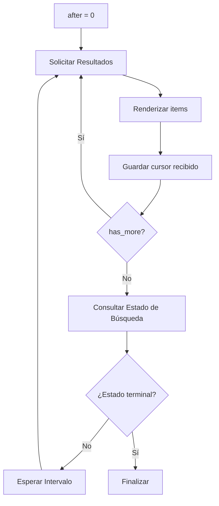

# Paginación por Cursor y Consistencia

## Resumen

Los resultados de una búsqueda se completan fuera de orden: varios workers pueden
procesar cartas distintas y una fuente lenta puede terminar después de otra carta
ubicada más adelante en la entrada. Paginar por posición original obliga a releer
ítems pendientes o produce huecos mientras la búsqueda sigue avanzando.

Muchi pagina por `completion_sequence`, una secuencia asignada cuando cada ítem
alcanza un estado terminal. El cursor representa progreso observado, no una página
estática ni la posición original de la carta.

## El Problema

La primera implementación conservaba los IDs de todos los ítems en la búsqueda y
los cargaba uno por uno al listar resultados. Ese modelo tenía tres costos:

- Una lectura por cada ítem, aunque todavía estuviera pendiente.
- Respuestas crecientes a medida que aumentaba el tamaño de la búsqueda.
- Ninguna frontera estable para que un cliente pidiera solamente resultados nuevos.

La posición de entrada tampoco resolvía el problema. Si la carta en posición 1
tardaba dos minutos y la posición 2 terminaba primero, esperar el orden original
ocultaba un resultado ya disponible.

## Secuencia de Finalización

Cuando un worker completa un ítem, la transacción lee su búsqueda padre, asigna
`completion_sequence = job.processed + 1`, guarda el ítem y sus ofertas, y actualiza
el progreso de la búsqueda. Dos workers que intentan usar la misma secuencia entran
en conflicto sobre el documento padre; Firestore reintenta una transacción y cada
ítem confirmado obtiene una secuencia distinta.



El cliente recibe B antes que A porque B terminó primero. No pierde A: conserva el
cursor 1 y la siguiente consulta encuentra cualquier secuencia posterior.

## Contrato HTTP

`GET /v1/searches/{search_id}/results` acepta:

- `after`: última `completion_sequence` consumida; por defecto `0`.
- `limit`: cantidad máxima de ítems; por defecto `50`, máximo `100`.

La respuesta contiene:

- `items`: resultados terminales posteriores al cursor.
- `cursor`: secuencia del último ítem devuelto, o el cursor recibido si no hubo ítems.
- `has_more`: indica que ya existen más resultados después de esta página.

`has_more: false` no significa necesariamente que la búsqueda terminó. Solo significa
que no había otra página materializada en ese instante. El estado de la búsqueda
decide si el cliente debe continuar el polling.

## Consulta e Índice

Firestore ejecuta una consulta por página:

```text
search_id == ID
completion_sequence > after
order by completion_sequence ascending
limit limit + 1
```

El elemento adicional no se devuelve; únicamente determina `has_more`. La consulta
requiere el índice compuesto de `firestore.indexes.json` sobre `search_id` y
`completion_sequence`.

Las ofertas viven en `item_offers`. Después de seleccionar los ítems de la página,
el Store carga el documento de ofertas correspondiente a cada uno. Los ítems fuera
de la página no producen lecturas de ofertas.

## Protocolo de Polling



El cursor debe avanzar solo después de procesar la respuesta. Si el cliente falla
antes, puede repetir el mismo `after`: la lectura es estable y puede renderizarse de
forma idempotente usando el ID del ítem.

## Invariantes

1. Solo los ítems terminales reciben `completion_sequence` positiva.
2. La secuencia es única y creciente dentro de una búsqueda.
3. Completar el ítem y avanzar el progreso ocurre en una transacción.
4. Un cursor nunca retrocede cuando una página está vacía.
5. `has_more` describe datos presentes, no el estado terminal de la búsqueda.
6. Repetir una página con el mismo cursor no pierde resultados.
7. La posición original se conserva para presentación, no para paginación incremental.

## Límites

El cursor es un entero interno, no un snapshot inmutable. Está diseñado para una
búsqueda que solo agrega resultados terminales y no vuelve a ordenar los ya
completados. Si el sistema permitiera editar o eliminar resultados durante el
polling, necesitaría un cursor opaco con una política explícita de versiones.

Los documentos están sujetos a TTL. Un cliente que retoma una búsqueda después de
su expiración recibe `not found`; el cursor no extiende la vida de los resultados.
