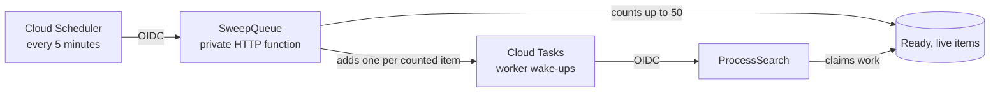

**English** | [Español](sweeper.es.md)

# The Sweeper Replaces Spent Queue Wake-ups

The sweeper is a recovery entry point for the API's task queue. Cloud Scheduler
invokes `SweepQueue` every five minutes. It counts ready items and adds one
Cloud Task wake-up for each counted item, capped at 50 per run by default.

## Why It Exists

Cloud Tasks carry a signal to process the next available item; they do not
carry an item ID. A worker turn can therefore spend a wake-up without claiming
work, for example when it encounters dead work or another turn has already
claimed the item. If ready items remain after the queue's wake-ups are spent,
those items have no event left to start another worker. The sweeper detects
that drift and supplies new wake-ups.

## What One Run Does

1. Cloud Scheduler sends an authenticated `POST` to the private function.
2. `SweepQueue` counts ready items, ignoring expired or malformed records.
3. If none are ready, it returns `{"woken":0}` without adding tasks.
4. Otherwise it asks the queue to wake a worker once per counted item.
5. The count is capped by `MUCHI_SWEEP_MAX_WAKES` (default 50). A missing or
   invalid cap falls back to one wake-up, never an unbounded dispatch.

The count is a bounded estimate of ready work, not a comparison with a live
Cloud Tasks depth. Task names are unique per wake-up, and normal queue
deduplication and worker claims remain responsible for concurrent delivery.

## What It Does Not Do

The sweeper does not process cards, reclaim leases, delete expired documents,
or repair orphaned queue records. A worker claims and processes work; its
transactional claim removes dead candidates. Firestore TTL deletes expired
records eventually, while the API rejects expired data before deletion. The
sweeper only restores execution opportunities when ready work may have lost
its wake-up.

If a sweep finds work, it emits a warning because ordinary dispatch should
usually keep the queue moving. Repeated warnings point to a queue or worker
accounting issue; the bounded run limits pressure on external sources while
the underlying cause is investigated.

## Deployment and Identity

`deploy-sweeper.sh` deploys a private second-generation HTTP function with the
`SweepQueue` entry point, then schedules it every five minutes. Cloud Scheduler
uses the task service account and an OIDC token whose audience is the function
URL. The function needs Firestore access to count items, permission to create
Cloud Tasks, and the configured API token at startup.

The implementation is in [`function.go`](../../function.go),
[`internal/sweep/sweeper.go`](../../internal/sweep/sweeper.go), and
[`internal/db/storage.go`](../../internal/db/storage.go).
