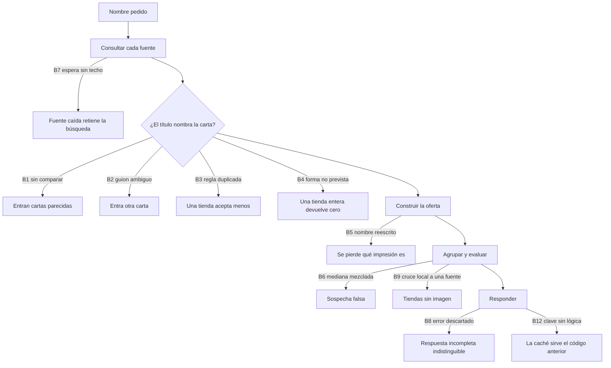

# Hallazgos en los Buscadores

[English](search-findings.md) | **Español**

## Resumen

Una pregunta simple abrió el resto: buscar `Kuriboh` devolvía `Winged Kuriboh`,
`Kuribon` y `Token: Kuriboh`. La causa inmediata era una fuente que no comparaba
el nombre, pero al taparla aparecieron otras once en la API y cinco en el front.

Casi todas viven en la misma costura: **lo que la tienda escribe contra lo que el
código cree que escribió**. Una tienda publica un título libre; el sistema deduce
de ese texto la carta, la edición, la imagen y el grupo de precios comparables.
Cada deducción que se equivoca produce un defecto distinto, y varios se tapaban
entre sí.

Este documento cubre la API. Los hallazgos del front viven en su propio
repositorio, porque allá está el código que los explica y allá envejecerían mal
si se copiaran acá: `docs/search-findings.es.md` de
[metaliaw/muchi](https://github.com/metaliaw/muchi). Los cinco nacen de un cambio
de esta API —`match=includes` trae cartas distintas, no variantes de una— y esa
sección los enumera.

Este documento registra qué se encontró, qué lo cerró y qué queda abierto. El
modelo de identidad que lo sustenta está en
[identidad de cartas entre juegos y ediciones](card-identity-games-sets.es.md);
el reparto de fuentes por juego, en
[búsqueda por juego, agregadores y tiendas](game-search-providers.es.md).

## Dónde Ocurre Cada Defecto



## Hallazgos en la API

| ID | Hallazgo | Estado |
| --- | --- | --- |
| B1 | `tcgmatch` no comparaba el nombre | Cerrado `2697d29` |
| B2 | El guion también vive dentro de los nombres | Cerrado `2697d29` |
| B3 | `matchesCard` duplicado en tres paquetes y derivado | Cerrado `cb6081b` |
| B4 | Cada fuente escribe el título a su manera | Cerrado `7f9696e` `c03a261` |
| B5 | Dos fuentes nombraban la oferta con el nombre buscado | Cerrado `569aeef` |
| B6 | La mediana de precios mezclaba cartas distintas | Cerrado `5bed67f` |
| B7 | Una tienda caída retenía la búsqueda dos minutos | Cerrado `74553c2` |
| B8 | El error de una fuente se descartaba en silencio | Cerrado `fa288e9` `634e866` |
| B9 | El cruce de imágenes servía a una sola fuente | Cerrado `510f282` |
| B10 | Un juego no aceptaba la plataforma de su tienda | Cerrado `f3efc81` |
| B11 | Las opciones de la búsqueda no llegaban al worker | Cerrado `d88032b` `b6e3a89` |
| B12 | La caché servía resultados del código anterior | Cerrado `0aa44c4` |

### B1. Una fuente no comparaba el nombre

`tcgmatch` filtraba por juego y por tipo, y confiaba en que el catálogo
devolviera la carta pedida. El catálogo responde por parecido. Era la única de
cinco fuentes que no pasaba por `MatchesCard`.

Buscar `Kuriboh` devolvía 34 ofertas y 4 eran Kuriboh. El resto: `Winged
Kuriboh`, `Kuribon`, `Kuribohrn`, `Sphere Kuriboh`, `Token: Kuriboh`,
`The Flute of Summoning Kuriboh`, `Performapal Kuribohble`.

### B2. El guion también vive dentro de los nombres

`" - "` entraba como separador de edición, pero `Kuriboh - Multiply!` es otra
carta. Quitarlo rompía Pokémon, donde el guion separa el código de colección.

Medido sobre títulos reales del catálogo, el guion explica 44 calces legítimos
—`Mewtwo - 052`, `Snorlax - SWSH119`, `Gengar - 60/162 (Cosmos Holo)`— y deja
pasar 2 intrusos.

Lo que los separa no es dígito contra letra: `SM214` y `SWSH068` son letras con
dígitos. **Un código lleva un dígito y una palabra no.** La cola de un guion debe
abrir con un token que contenga un dígito: 27 de 27 códigos aceptados, 2 de 2
intrusos rechazados. Los corchetes `" ("`, `" ["` y `" | "` no viven dentro de un
nombre de carta y no necesitan esa prueba.

### B3. La misma regla, copiada tres veces y derivada

`matchesCard` vivía copiado en `shopify`, `jumpseller` y `prestashop`. Las dos
últimas eran idénticas byte a byte; la primera difería en una línea: le faltaba
el separador `" | "`.

Nadie lo eligió. Alguien lo agregó a dos copias y se olvidó de la tercera, y el
test de Shopify no tenía ningún caso que lo notara. El costo de la copia no son
los bytes repetidos, sino que se separen sin que nadie se entere.

Antes de unificar se comparó la regla local contra la compartida sobre 138
títulos reales de las tres tiendas Shopify: cero desacuerdos.

### B4. Cada fuente escribe el título a su manera

Konoha lidera con el código de set y encierra el nombre entre comillas, al medio
del título. El catálogo de WooCommerce exigía igualdad exacta, así que sus cerca
de 4000 cartas devolvían cero.

Resuelto el calce, quedaba el agrupamiento: la misma carta salía partida en
tantos grupos como formas de escribirla hubiera.

```text
Winged Kuriboh                                     ┐
LDS3-EN100 “Winged Kuriboh” Common Effect Monster  ├→ winged kuriboh
Winged Kuriboh (PUR)                               ┘
```

`ReadCardKey` baja el título a la carta que nombra: desenvuelve la forma entre
comillas, corta la cola de impresión con las mismas reglas que deciden el calce, y
nivela los tres guiones, porque `Kuriboh - Multiply!` y `Kuriboh – Multiply!` son
una carta escrita dos veces. La API la calcula una vez y la publica como
`card_key`; agrupar por ella llevó 28 tipos de carta a 16 sobre las mismas 40
ofertas.

### B5. Dos fuentes nombraban la oferta con el nombre buscado

`jumpseller` escribía el nombre buscado encima después de calzar; `shopify` lo
ponía al construir la oferta. Seis ofertas de `Sol Ring` a precios distintos
salían las seis llamadas `Sol Ring`, con el título real escondido en
`metadata.title`.

Además de ocultar la impresión, rompía el agrupamiento de B4 desde adentro:
`card_key` se calcula del nombre, así que un `Kuriboh - Multiply!` de una tienda
Jumpseller caería bajo `kuriboh`. El nombre buscado entra a la consulta, no a la
respuesta.

### B6. La mediana de precios mezclaba cartas distintas

`MarkSuspicious` sacaba una mediana por moneda sobre toda la respuesta. Con
`match=includes` esa respuesta lleva cartas distintas, y la mediana termina
mezclando un Starlight Rare de 400.000 con un common de 300.

Siete grupos perdían su corona de «más barato» por precios ajenos, y todos eran
la única oferta de su carta: `Kuribohrn` 250, `The Flute of Summoning Kuriboh`
300, `LDS3-EN100 “Winged Kuriboh”` 400, `Kuriboh (C)` 553.

`PriceGroupOf` agrupa por moneda **y** por carta. Bajo `exact` toda oferta es la
misma carta y sus impresiones compiten entre ellas; bajo `includes` cada título es
otra carta. Esa distinción importa: agrupar siempre por título crudo dejaría a
`Kuriboh`, `Kuriboh (C)` y `Kuriboh [LDS3-EN100]` en tres grupos de una oferta, y
una mediana de uno no marca a nadie —la sospecha se apagaría sola.

Sospechosas 9 → 3 → 1. Coronadas 21/28 → 28/28.

### B7. Una tienda caída retenía la búsqueda dos minutos

`v3.netdecker.cl` bajó su sitio y responde `503` con `Retry-After: 3600`. El
cliente obedecía esa cabecera sin techo: esperaba una hora y solo lo cortaba el
deadline del contexto. El sondeo vivo tardaba dos minutos en fallar lo que `curl`
falla en 0,7 s.

`Retry-After` pasó a ser una propuesta que el cliente puede rechazar, por dos
razones que bastan por separado: más de 30 segundos no es una espera sino un
«vuelve mañana», y una espera que no cabe en el presupuesto restante solo gasta
el deadline del llamador para llegar al mismo error. Vive en `source.Client`, así
que cubre a todas las plataformas.

### B8. El error de una fuente se descartaba en silencio

Si una fuente fallaba y otra respondía, `collectOffers` devolvía las ofertas y
descartaba el error. La API contestaba `200` y una respuesta a medias se veía
igual que una completa. Costó dos sondeos a mano descubrir que
`www.deckscards.cl` estaba fallando.

`OfferSource` y `Provider` ahora piden `SourceName()`, que devuelve el mismo
identificador que usa `/v1/health/sources`. La respuesta lleva `faults` siempre,
vacío incluido: un campo que aparece solo cuando hay problemas enseña a no
mirarlo. Una respuesta con faults no se guarda en caché.

El mensaje del fallo se acortó a una línea. La página de mantención de Netdecker
son 1369 bytes de HTML que viajaban enteros dentro de cada línea de log y de cada
`fault`; el cuerpo sigue disponible en `StatusError.Body`.

### B9. El cruce de imágenes servía a una sola fuente

La máquina que cruza un título con las impresiones de Scryfall vivía dentro de
`scry`. Las tiendas directas quedaban en cero: una tienda publica un título y un
precio, nunca una imagen.

`IndexPrints` y `ImageFor` se mudaron a `cardmetadata`, donde vive `Print`. El
servicio las aplica una vez por carta, después de deduplicar, y solo a la oferta
que llegó sin imagen. `PrintsByGame` deja fuera a Pokémon y Yu-Gi-Oh: Scryfall
conoce Magic.

| Fuente | Ofertas | Antes | Ahora |
| --- | --- | --- | --- |
| `scry.cl` | 150 | 78 | 78 |
| `gameofmagicsingles.cl` | 35 | 0 | 29 |
| `www.cardsouls.cl` | 22 | 0 | 22 |
| `singles.collectorcenter.cl` | 19 | 0 | 0 |
| `onplay.cl`, `lacripta.cl`, `moxfield` | 17 | 0 | 0 |
| **Total** | **243** | **78** | **129** |

### B10. Un juego no aceptaba la plataforma de su tienda

Agregar una tienda WooCommerce a Yu-Gi-Oh no bastaba: `woocommerce` no estaba
entre los `origins` del juego, porque la plataforma solo servía a Magic. La
tienda y el juego son dos permisos separados y es fácil dar uno solo.

### B11. Las opciones de la búsqueda no llegaban al worker

`VerifyStock` y `StoresOnly` llevaban `json:"-"`, y el ítem se persiste
serializado: `json.Marshal` los descartaba al escribir y el worker, que lee el
ítem de vuelta en otro proceso, los leía siempre en falso. `verify_stock` no
hacía nada en una búsqueda asíncrona.

La etiqueta estaba pensada para lo que no debe viajar —el arriendo, que cambia en
cada reclamo y vive en el registro de Firestore—. Las opciones existen para
viajar.

`stores_only` además no la leía nadie: solo aparecía declarada, asignada y
persistida, mientras el contrato la exigía. Salió de `Options`, de `Item`, de
Firestore, del `openapi.yaml` y de la colección de Bruno. **El orden importa:** el
front dejó de mandarla y se desplegó primero, porque `decodeJSON` usa
`DisallowUnknownFields` y sacarla antes habría devuelto `400` a cada búsqueda.

### B12. La caché servía resultados del código anterior

Desplegado B9, producción devolvía 78 imágenes donde el sondeo local daba 129. La
clave se arma del namespace y de la configuración de tiendas, y ninguna había
cambiado: lo que cambió fue la lógica, y la clave no la mira.

El número a mano en `search-providers-vN` es la única parte que puede decir «esto
ya no se calcula igual». **Subirlo es obligatorio cada vez que cambia una regla
que altera las ofertas**, aunque no cambie `config/stores.yaml`.

## Lo que Queda Abierto

Ordenado por lo que destraba a lo demás.

1. **Cuatro fuentes siguen sin imagen y la regla está bien.**
   `singles.collectorcenter.cl` escribe `Sol Ring - 409 - mythic`: número sin
   edición. `onplay.cl` y `lacripta.cl` publican el título pelado. Ninguna nombra
   una edición y la regla no inventa. Cubrirlas pide leer la edición de la página
   del producto.
2. **La sospecha por impresión está bloqueada por datos.** Dentro de
   `winged kuriboh` conviven 300, 400, 500, 4000 y 4500: un common contra un
   secret rare. `tcgmatch` manda `set_code` vacío en Yu-Gi-Oh y el catálogo
   WooCommerce no manda metadata, así que las seis ofertas se ven idénticas en
   todos los campos. Se destraba con el punto 1.
3. **`SourceFault.reason` todavía concatena código y cuerpo.** Bajó de 1369 a 147
   bytes, pero la forma correcta es el código separado del cuerpo.
4. **`www.deckscards.cl` falla de forma intermitente** con
   `Jumpseller pagination repeated products` tras unos 85 segundos. El contador
   sube antes del calce, así que no lo provoca ninguna regla de comparación. Desde
   B8 al menos se ve en `faults`.
5. **`deploy.sh` no corre las pruebas.** `./build.sh` existe, pasa y valida, pero
   ningún `deploy-*.sh` lo llama: hay que hacerlo a mano antes de desplegar.

## Qué Dejó Esta Ronda como Método

- **Medir antes de cambiar una regla de comparación.** Ensanchar o angostar el
  calce solo se juzga contra títulos reales de las fuentes. Los números de B2, B3
  y B9 salieron de sondeos sobre catálogos vivos, no de ejemplos inventados.
- **Probar por mutación.** Cada arreglo tiene un caso que falla si se revierte.
  Varios defectos duraron porque ninguna prueba los notaba.
- **Verificar contra producción.** B12 apareció justamente porque el número local
  y el de producción no coincidían.
- **Desplegar el consumidor antes que el contrato** cuando se retira un campo, por
  `DisallowUnknownFields`.

## Ver También

Los hallazgos del front —cómo se ordenan, coronan y compran las ofertas que esta
API devuelve— están en `docs/search-findings.es.md` de
[metaliaw/muchi](https://github.com/metaliaw/muchi).
