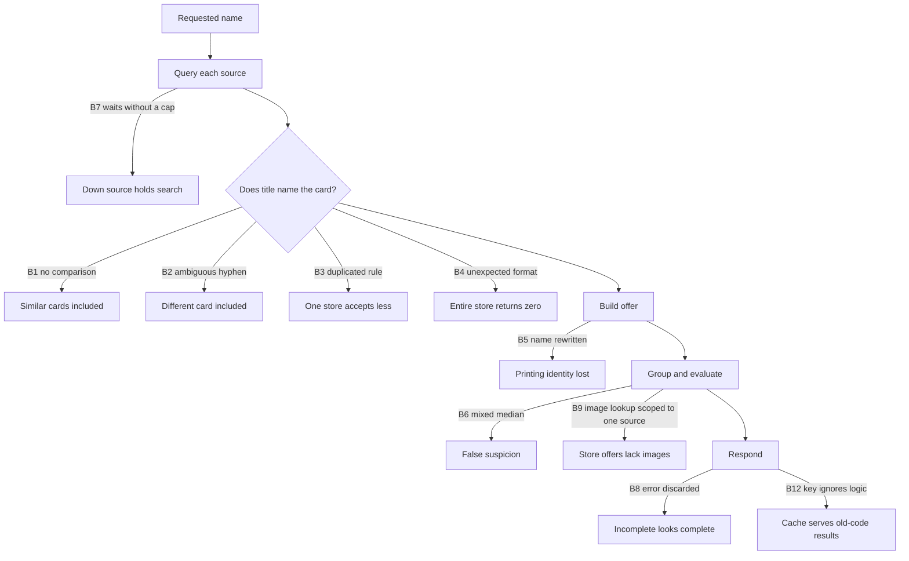

# Search Findings

[English](search-findings.md) | [Español](search-findings.es.md)

## Summary

A simple query exposed the rest: searching for `Kuriboh` returned `Winged
Kuriboh`, `Kuribon`, and `Token: Kuriboh`. The immediate cause was a source that
did not compare names, but fixing it revealed eleven more issues in the API and
five in the Front.

Almost all sit at the same seam: **what the store writes versus what the code
thinks it wrote**. A store publishes a free-form title; the system infers the
card, set, image, and comparable price group from that text. Each wrong inference
creates a different defect, and several defects hid one another.

This document covers the API. Front findings live in their own repository,
because that is where the code they explain lives, and copying them here would
make them stale: see `docs/search-findings.es.md` in
[metaliaw/muchi](https://github.com/metaliaw/muchi). All five came from an API
change—`match=includes` returns different cards, not variants of one card—and
that section lists them.

This document records what was found, what closed it, and what remains open. The
identity model behind it is in [card identity across games and sets](card-identity-games-sets.md);
source assignment by game is in [game search, aggregators, and stores](game-search-providers.md).

## Where Each Defect Occurs



## API Findings

| ID | Finding | Status |
| --- | --- | --- |
| B1 | `tcgmatch` did not compare the name | Closed `2697d29` |
| B2 | Hyphens also appear inside names | Closed `2697d29` |
| B3 | `matchesCard` duplicated across three packages and diverged | Closed `cb6081b` |
| B4 | Every source writes titles differently | Closed `7f9696e` `c03a261` |
| B5 | Two sources named offers with the search name | Closed `569aeef` |
| B6 | Price median mixed different cards | Closed `5bed67f` |
| B7 | A down store held a search for two minutes | Closed `74553c2` |
| B8 | A source error was silently discarded | Closed `fa288e9` `634e866` |
| B9 | Image lookup served only one source | Closed `510f282` |
| B10 | A game did not accept its store's platform | Closed `f3efc81` |
| B11 | Search options did not reach the worker | Closed `d88032b` `b6e3a89` |
| B12 | Cache served results from old code | Closed `0aa44c4` |

### B1. A Source Did Not Compare the Name

`tcgmatch` filtered by game and kind, trusting the catalog to return the
requested card. The catalog answers by similarity. It was the only one of five
sources that did not pass through `MatchesCard`.

Searching `Kuriboh` returned 34 offers, of which 4 were Kuriboh. The rest
included `Winged Kuriboh`, `Kuribon`, `Kuribohrn`, `Sphere Kuriboh`, `Token:
Kuriboh`, `The Flute of Summoning Kuriboh`, and `Performapal Kuribohble`.

### B2. Hyphens Also Appear Inside Names

`" - "` was treated as a set separator, but `Kuriboh - Multiply!` is a
different card. Removing it broke Pokémon, where a hyphen separates the
collection number.

Measured against real catalog titles, the hyphen explains 44 legitimate matches
—`Mewtwo - 052`, `Snorlax - SWSH119`, `Gengar - 60/162 (Cosmos Holo)`—and lets
through 2 false matches.

The distinction is not digit versus letter: `SM214` and `SWSH068` contain
letters and digits. **A code contains a digit; a word does not.** The suffix after
a hyphen must start with a token containing a digit: 27 of 27 accepted codes and
2 of 2 rejected false matches. The separators `" ("`, `" ["`, and `" | "` do
not occur inside card names, so they need no such check.

### B3. One Rule Was Copied Three Times and Diverged

`matchesCard` was duplicated in `shopify`, `jumpseller`, and `prestashop`. The
last two were byte-for-byte identical; the first differed by one line: it lacked
the `" | "` separator.

Nobody chose this. Someone added the separator to two copies and forgot the
third, and the Shopify test had no case to detect it. The cost of duplication is
not repeated bytes; it is divergence nobody notices.

Before unifying the rule, the local version was compared with the shared one
against 138 real titles from three Shopify stores: zero disagreements.

### B4. Every Source Writes Titles Differently

Konoha puts the set code first and quotes the name in the middle of the title.
The WooCommerce catalog required exact equality, so about 4,000 cards returned
zero results.

After matching was fixed, grouping remained: the same card split into as many
groups as there were ways to write its name.

```text
Winged Kuriboh                                     ┐
LDS3-EN100 “Winged Kuriboh” Common Effect Monster  ├→ winged kuriboh
Winged Kuriboh (PUR)                               ┘
```

`ReadCardKey` reduces a title to the card it names: unwraps a quoted name, cuts
the printing suffix using the same rules as matching, and normalizes three
hyphen characters because `Kuriboh - Multiply!` and `Kuriboh – Multiply!` are
the same card written twice. The API computes the key once and publishes it as
`card_key`; grouping by it reduced 28 card types to 16 across the same 40 offers.

### B5. Two Sources Named Offers with the Search Name

`jumpseller` overwrote the title with the requested name after matching;
`shopify` did so while building the offer. Six `Sol Ring` offers at different
prices were all called `Sol Ring`, hiding the real title in `metadata.title`.

Besides hiding the printing, this broke B4 grouping from within: `card_key` is
computed from the name, so a Jumpseller offer named `Kuriboh - Multiply!` would
be grouped under `kuriboh`. The requested name belongs in the query, not the
response.

### B6. Price Median Mixed Different Cards

`MarkSuspicious` computed a median per currency across the entire response. With
`match=includes`, that response contains different cards, so the median mixed a
Starlight Rare priced at 400,000 with a common priced at 300.

Seven groups lost their “cheapest” status due to unrelated prices, and each was
the only offer for its card: `Kuribohrn` 250, `The Flute of Summoning Kuriboh`
300, `LDS3-EN100 “Winged Kuriboh”` 400, and `Kuriboh (C)` 553.

`PriceGroupOf` groups by **currency and card**. With `exact`, every offer is the
same card and its printings compete; with `includes`, each title is a different
card. This distinction matters: always grouping by raw title would put `Kuriboh`,
`Kuriboh (C)`, and `Kuriboh [LDS3-EN100]` into three single-offer groups, where
a median of one marks nothing and suspicion silently disappears.

Suspicious offers: 9 → 3 → 1. Cheapest: 21/28 → 28/28.

### B7. A Down Store Held the Search for Two Minutes

`v3.netdecker.cl` took its site down and returned `503` with
`Retry-After: 3600`. The client obeyed the header without a cap, waited an hour,
and was stopped only by the context deadline. The live probe took two minutes to
fail on what `curl` rejected in 0.7 seconds.

`Retry-After` became a proposal the client may reject for either of two
independent reasons: over 30 seconds is not a pause but “come back tomorrow,” and
a wait that cannot fit in the remaining budget only consumes the caller's
deadline before reaching the same error. The rule lives in `source.Client` and
covers every platform.

### B8. A Source Error Was Silently Discarded

If one source failed and another responded, `collectOffers` returned the offers
and discarded the error. The API returned `200`, and a partial response looked
complete. Two manual probes were needed to discover that `www.deckscards.cl` was
failing.

`OfferSource` and `Provider` now require `SourceName()`, which returns the same
identifier used by `/v1/health/sources`. The response always includes `faults`,
even when empty: a field that appears only during problems teaches clients to
ignore it. Responses with faults are not cached.

The failure message was shortened to one line. Netdecker's maintenance page was
1,369 bytes of HTML included in every log line and each `fault`; the body remains
available in `StatusError.Body`.

### B9. Image Lookup Served Only One Source

The logic that matches a title with Scryfall printings lived inside `scry`.
Direct stores returned no images: a store publishes a title and price, not an
image.

`IndexPrints` and `ImageFor` moved to `cardmetadata`, where `Print` lives. The
service applies them once per card after deduplication, only to offers missing an
image. `PrintsByGame` excludes Pokémon and Yu-Gi-Oh! because Scryfall knows Magic.

| Source | Offers | Before | After |
| --- | ---: | ---: | ---: |
| `scry.cl` | 150 | 78 | 78 |
| `gameofmagicsingles.cl` | 35 | 0 | 29 |
| `www.cardsouls.cl` | 22 | 0 | 22 |
| `singles.collectorcenter.cl` | 19 | 0 | 0 |
| `onplay.cl`, `lacripta.cl`, `moxfield` | 17 | 0 | 0 |
| **Total** | **243** | **78** | **129** |

### B10. A Game Did Not Accept Its Store's Platform

Adding a WooCommerce store to Yu-Gi-Oh! was not enough: `woocommerce` was not in
that game's `origins`, because the platform had only served Magic. Store and game
are two separate permissions, and it is easy to grant only one.

### B11. Search Options Did Not Reach the Worker

`VerifyStock` and `StoresOnly` had `json:"-"`, and items are persisted through
JSON serialization. `json.Marshal` discarded them while writing, so the worker,
which reads the item back in another process, always saw false.
`verify_stock` did nothing in an asynchronous search.

The tag was intended for data that must not travel—the lease, which changes on
every claim and lives in the Firestore record. Search options need to travel.

`stores_only` was also read by nobody: it was only declared, assigned, and
persisted, even though the contract required it. It was removed from `Options`,
`Item`, Firestore, `openapi.yaml`, and the Bruno collection. **Order mattered:**
the Front stopped sending it and was deployed first because `decodeJSON` uses
`DisallowUnknownFields`; removing it before that would have returned `400` for
every search.

### B12. Cache Served Results from Old Code

After B9 was deployed, production returned 78 images while the local probe
returned 129. The key was built from a namespace and store configuration, neither
of which had changed. The logic changed, but the key did not account for it.

The manually maintained number in `search-providers-vN` is the only signal that
can mean “this is no longer calculated the same way.” **It must increase any
time a rule that changes offers changes**, even when `config/stores.yaml` does not.

## What Remains Open

Ordered by what unlocks the rest:

1. **Four sources still have no image, and the rule is correct.**
   `singles.collectorcenter.cl` writes `Sol Ring - 409 - mythic`: a number
   without a set. `onplay.cl` and `lacripta.cl` publish a bare title. None names a
   set, and the rule does not invent one. Supporting these requires reading the
   set from the product page.
2. **Suspicion by printing is blocked by missing data.** Within `winged kuriboh`,
   prices include 300, 400, 500, 4,000, and 4,500: a common alongside a secret
   rare. `tcgmatch` sends an empty `set_code` for Yu-Gi-Oh!, and the WooCommerce
   catalog provides no metadata, so all six offers appear identical. The first
   item unlocks this.
3. **`SourceFault.reason` still combines code and body.** It fell from 1,369 to
   147 bytes, but the correct shape separates the code from the body.
4. **`www.deckscards.cl` fails intermittently** with
   `Jumpseller pagination repeated products` after about 85 seconds. The counter
   increments before matching, so no matching rule causes it. Since B8 it is at
   least visible in `faults`.
5. **`deploy.sh` does not run tests.** `./build.sh` exists, passes, and validates,
   but no `deploy-*.sh` calls it; it must be run manually before deployment.

## Method from This Round

- **Measure before changing a matching rule.** Broader or narrower matching
  should be judged against real source titles. B2, B3, and B9 measurements came
  from live catalog probes, not invented examples.
- **Test by mutation.** Each fix has a case that fails if reverted. Several bugs
  lasted because no test noticed them.
- **Verify against production.** B12 appeared because local and production counts
  disagreed.
- **Deploy the consumer before the contract** when removing a field because of
  `DisallowUnknownFields`.

## See Also

Front findings—how offers from this API are sorted, ranked, and purchased—live in
`docs/search-findings.es.md` in
[metaliaw/muchi](https://github.com/metaliaw/muchi).
