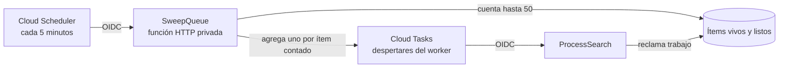

[English](sweeper.md) | **Español**

# El Barredor Repone Despertares Gastados

El barredor es un punto de recuperación para la Cola de tareas de la API.
Cloud Scheduler invoca `SweepQueue` cada cinco minutos. Cuenta ítems listos y
agrega un despertar de Cloud Tasks por cada uno, con tope predeterminado de 50
por ejecución.

## Para Qué Existe

Cloud Tasks lleva una señal para procesar el siguiente ítem disponible; no
lleva un identificador de ítem. Un turno del worker puede gastar un despertar
sin reclamar trabajo, por ejemplo si encuentra trabajo muerto o si otro turno
ya reclamó el ítem. Si quedan ítems listos después de gastar los despertares,
no queda un evento que inicie otro worker. El barredor detecta ese desfase y
agrega nuevos despertares.

## Qué Hace una Ejecución

1. Cloud Scheduler envía un `POST` autenticado a la función privada.
2. `SweepQueue` cuenta ítems listos e ignora registros vencidos o mal formados.
3. Si no hay ítems, responde `{"woken":0}` sin agregar tareas.
4. Si hay, pide a la Cola despertar un worker por cada ítem contado.
5. El conteo queda limitado por `MUCHI_SWEEP_MAX_WAKES` (por defecto, 50). Si
   falta el tope o no es válido, usa uno; nunca despacha sin límite.

El conteo es una estimación acotada del trabajo listo, no una comparación con
la profundidad instantánea de Cloud Tasks. Los nombres de tarea son únicos
por despertar, y la deduplicación normal de la Cola y los reclamos del worker
siguen controlando entregas concurrentes.

## Qué No Hace

El barredor no procesa cartas, no recupera leases, no borra documentos vencidos
ni repara registros huérfanos de la Cola. El worker reclama y procesa trabajo;
su reclamo transaccional elimina candidatos muertos. Firestore TTL borra datos
vencidos de forma eventual, mientras la API los rechaza antes del borrado. El
barredor solo repone oportunidades de ejecución cuando el trabajo listo pudo
perder su despertar.

Si un barrido encuentra trabajo, registra una advertencia porque el despacho
normal debería mantener la Cola avanzando. Advertencias repetidas apuntan a un
problema de conteo de Cola o Workers; el límite reduce presión sobre las
fuentes mientras se investiga la causa.

## Despliegue e Identidad

`deploy-sweeper.sh` despliega una función HTTP privada de segunda generación
con el entrypoint `SweepQueue` y la programa cada cinco minutos. Cloud
Scheduler usa la cuenta de servicio de tareas y un token OIDC cuya audiencia
es la URL de la función. La función necesita acceso a Firestore para contar,
permiso para crear Cloud Tasks y el token de API configurado al iniciar.

La implementación vive en [`function.go`](../function.go),
[`internal/sweep/sweeper.go`](../internal/sweep/sweeper.go) y
[`internal/db/storage.go`](../internal/db/storage.go).
