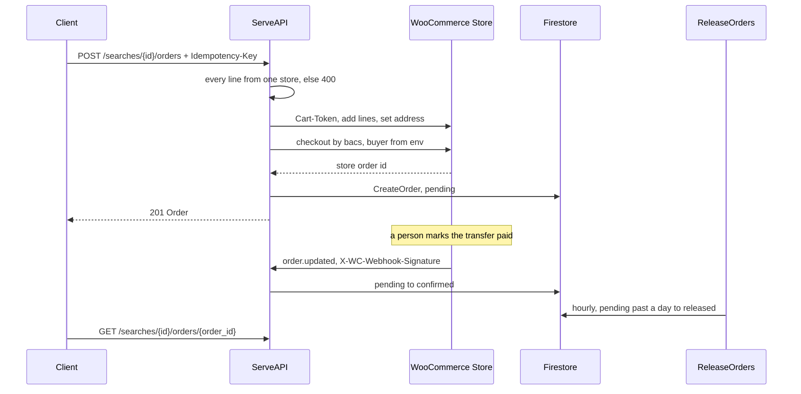
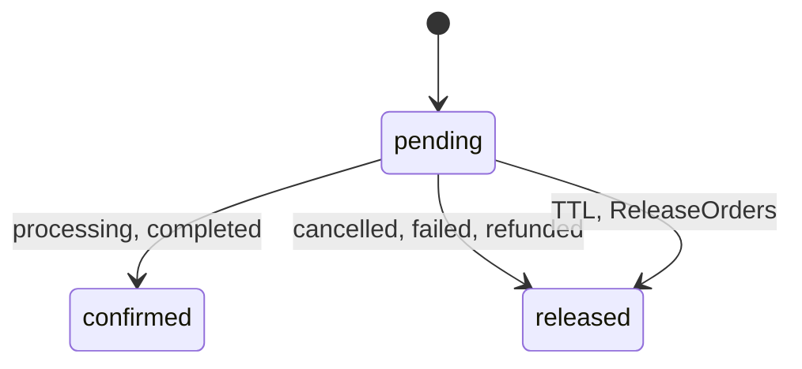

# The Purchase Flow in Progress (UNDISTILLED)

Muchi finds offers; now it is learning to buy them.
This is the flow as it stands, one step past what the docs promise.
Distill each part into `docs/checkout/` or the code once the pilot has run.

## The Three Levels

| Level | Reaches | Platforms |
| --- | --- | --- |
| 0. Link | A filled cart, a person pays | Shopify (permalink), WooCommerce (one line) |
| 1. Quote | Subtotal, shipping and payment methods, no order | WooCommerce, Shopify |
| 1. Order | A real `pending` order, paid by bank transfer | WooCommerce only |
| 2. Script | The whole checkout, card included | Nobody yet |

Jumpseller and PrestaShop stop at product pages.
El Wombat Rabioso is handled in-house and needs none of it.

## One Order, End to End

Every move names the status it leaves, so the first writer wins
and a late webhook or a late sweep loses without overwriting.

## What Is Built

- `stores.Orderer` gates `PlaceOrder` to enabled WooCommerce stores;
  every other platform answers `422 order_not_supported`.
- `woocommerce.Client.PlaceOrder` refuses to run on the placeholder buyer
  (`orders@muchi.invalid`); `config/deploy.env` sets a provisional inbox.
- The webhook verifies HMAC-SHA256 in constant time and refuses every
  delivery when no secret is configured.
- `GET /v1/searches/{search_id}/orders/{order_id}` reads an order back,
  only through the search that placed it.

## What Is Still Open

- **No live order yet.** The manual pilot checklist in
  `docs/checkout/agentless-checkout.md` has never run.
- **The buyer is Muchi.** Orders check out under one provisional identity;
  who the real buyer is, and who pays the transfer, is not decided.
- **One platform.** Shopify and Jumpseller orders need a browser (level 2).

## Where It Distills

- The flow and the state machine → `docs/architecture.md` (done, both languages).
- The pilot's outcome → `docs/checkout/agentless-checkout.md`.
- The `orders` index and the full deploy → done: `firestore.indexes.json`,
  `deploy-infra.sh`, `deploy.sh`.
- Who the buyer is → a decision in `docs/checkout/`, once someone makes it.

Delete this story when those land.
