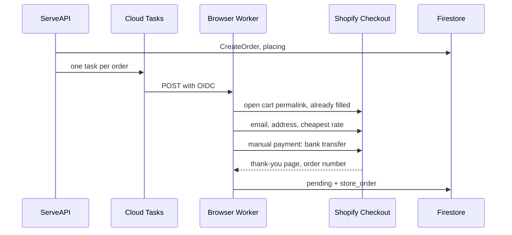

# Shopify Orders Need a Browser (SPECULATIVE)

WooCommerce reaches a real order over HTTP. Shopify does not:
its AJAX cart fills and quotes, but checkout lives in a web page.
Seven enabled stores are Shopify, and they are the only reach Muchi has
into Pokémon, One Piece, Digimon, Riftbound and Mitos y Leyendas.

## The Shape

A fixed script, no model, one store per run — level 2 in
`docs/checkout/agentless-checkout.md`.

1. Muchi already builds the cart permalink (level 0). The browser starts there,
   so no product lookup happens in the script.
2. Checkout fills contact and address from the same `ShippingAddress` the
   quote used, and keeps the rate the quote already chose.
3. Payment is the hinge. A Shopify **manual payment method** (bank deposit)
   creates the order with payment pending — the same shape as WooCommerce
   `bacs`. No card, no Muchi money moves inside the script.
4. The thank-you page carries the order number; that is `store_order`.

The browser is slow and heavy, so it cannot run inside `ServeAPI`. It needs
its own private worker behind Cloud Tasks, and the order a status before
`pending` — `placing` — so the API can answer `202` and the client polls
`GET /v1/searches/{id}/orders/{order_id}`.

## What Must Be Measured First

- **Which stores offer bank deposit.** Shopify shows payment methods only
  inside checkout. One manual walk per store, stopping before paying.
- **Bot protection.** Shopify checkout may raise a challenge on headless
  traffic. If it does on any store, that store stays at level 0.
- **Terms.** Each store's terms on automated purchases (already open in
  `agentless-checkout.md`).

## What Does Not Carry Over from WooCommerce

- **Confirmation.** A store's own Shopify webhook needs its admin to point it
  at Muchi; the WooCommerce path already asks that of each store. Without it,
  the only signal is the buyer inbox receiving "payment received".
- **Release.** `ReleaseOrders` frees Muchi's record, not the store's order.
  A Shopify order left unpaid is cancelled by the store's own timeout,
  if it has one.
- **Selectors drift.** Checkout markup changes with Shopify releases; the
  script needs a smoke run on a schedule, never on a real order.

## Where It Distills

- The decision to build it or not → `docs/checkout/agentless-checkout.md`.
- The `placing` status and the browser worker → `docs/architecture.md`,
  `internal/model`, a new entry point.
- The browser steps → code with a test against a recorded checkout page.

## What Shipped Instead, First

The buyer-reported path (`linked → reported`, see
`docs/checkout/agentless-checkout.md`) covers every Shopify store today
without a browser. This script is only worth building where a reported
order is not enough: when Muchi itself must pay and hold the order.

Distill after the WooCommerce pilot has placed one real order.
